+++
title = 'PennFish: Detecting Phishing Websites - A Machine Learning Approach'
date = '2024-04-23'
description = 'PennFish: Detecting Phishing Websites - A Machine Learning Approach'
tags = [
    "Phishing",
]
categories = [
    "Phishing",
]
series = ["Reports"]
image = "PennFish_Detecting_Phishing_Websites_-_A_Machine_Learning_Approach.jpg"
+++

<!-- ## PennFish: Detecting Phishing Websites - A Machine Learning Approach -->

<!--  -->

Team Project of CIS 5450 Big Data Analytics

## Pennfish Web App Demo

Screencast Video Demo:

<video width="100%" autoplay loop controls>
  <source src="pennfish-app-demo.mp4" type="video/mp4">
  Your browser does not support the video tag.
</video>

## Background

### **Need for Advanced Detection Systems**

In recent years, the rise of internet and cloud technologies has significantly increased the volume of  online purchases and transactions. This expansion has led to unauthorized access to sensitive user information and compromised enterprise resources. Phishing, a common type of attack, deceives users into accessing malicious content to steal their information (Dutta, 2021).

Often, phishing websites mimic legitimate ones in terms of their interface and URL (Levy, 2004). 

Various methods, including blacklists and heuristic approaches, have been proposed to detect these phishing sites. However, heuristics are more effective in detecting phishing sites than blacklists due to their short lifetime and ability to distinguish legitimate from phishing sites (Gastellier-Prevost, 2011). 

Current research indicates that the effectiveness of phishing detection systems is limited, highlighting the need for more advanced, intelligent techniques to safeguard users against these cyber threats (Dutta, 2021).

### A Machine Learning Approach: Idea Formulation

ML models can learn from large amounts of data to recognize patterns that are typical of phishing sites. 

Consider two URLs:

- `https://upenn-payments.xyz/payment.php` and
- `https://srfs.upenn.edu/billing-payment/pennpay`.

At first glance to an unsuspecting user, both might appear legitimate, but a ML model can be trained to detect phishing to evaluate their features. For instance, the domain name `penn-payments.xyz` might raise red flags as it uses a less common and perhaps sketchy top-level domain (`.xyz`) compared to the more trusted `.edu` TLD in `srfs.upenn.edu`. 

)](Untitled.png)

Source: MDN ([https://developer.mozilla.org/en-US/docs/Learn/Common_questions/Web_mechanics/What_is_a_URL](https://developer.mozilla.org/en-US/docs/Learn/Common_questions/Web_mechanics/What_is_a_URL))

Moreover, the first URL is shorter and lacks a path structure that implies a deeper, more organized content hierarchy as seen in the second URL with `/billing-payment/pennpay`. 

Our assumption is that by extracting and analyzing these URL features, a machine learning model can learn to predict potential phishing threats with greater accuracy, providing a feasible and powerful tool in cybersecurity efforts.

We plan to use ML models to leverage these features to scrutinize URLs and identify potential phishing threats.

## Project Overview

In our project, we've used a number of machine learning approaches. 

Here’s a brief overview:

1. **Data Pre-processing** -  we started the project with cleaning the data and exploring additional sources of data that we can integrate into the original dataset. 
2. **Exploratory Data Analysis (EDA) -** we explored the data to understand the characteristics and patterns that might be present.
3. **Feature Engineering** - We modify features from the existing data to better extract patterns that can be important for phishing detection.
4. **Linear Regression (Unregularized)** - This is a basic approach where we try to fit a straight line that predicts phishing likelihood based on input features.
5. **Ridge Regression** - To analyze data that suffers from multicollinearity (when independent variables are highly correlated).
6. **Logistic Regression** - A step up from linear regression, this method is specifically used for binary classification tasks like ours (phishing or not).
7. **PCA to Reduce Dimensionality, Logistic Regression with PCA** - This approach first reduces the complexity of the data using Principal Component Analysis (PCA) and then applies logistic regression to the simplified data.
8. **Decision Tree Classifier** - We used it to makes decisions based on asking a series of specific questions about the features of the URL.
9. **Random Forest Classifier** - An ensemble method that uses multiple decision trees to improve the classification accuracy.
10. **SVM (Support Vector Machine)** - A more sophisticated classification technique that finds the best boundary to differentiate between phishing and non-phishing URLs.
11. **Artificial Neural Network Model** - We ended the project by leveraging ANN to model and predict phishing URLs, capable of capturing intricate patterns in the data.

## Dive into the Datasets

[UCI Machine Learning Repository](https://archive.ics.uci.edu/dataset/967/phiusiil+phishing+url+dataset)

### Dataset Selection

For our project on detecting phishing URLs, we chose a dataset crafted by Arvind Prasad and Shalini Chandra, as detailed in their paper titled "[PhiUSIIL: A diverse security profile empowered phishing URL detection framework based on similarity index and incremental learning](https://www.sciencedirect.com/science/article/abs/pii/S0167404823004558)." 

This data set was released in March 2024.

This dataset is specifically created for the task of phishing URL detection and includes a robust framework that leverages a similarity index. This index is quite effective in identifying visual similarity-based attacks, such as those involving zero-width characters, homographs, punycode, homophones, bit squatting, and combosquatting.

We selected this dataset because of its richness and the extensive range of features it offers, which are not typically available in more generic datasets such as similar ones from Kaggle.

### Features of the Original Dataset

Let's check the first few rows of the dataset.

```python
df_features.head(2)
```

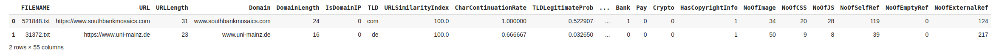

The author of this dataset has described the features in the dataset as follows:

- `TLD`: TLD (Top Level Domain) is the last part of the domain name, such as .com or .edu. Phishing URLs often use TLDs that are not commonly associated with the legitimate domain, such as .link or .inf.
- `URLLength`: Phishing URLs are often longer than legitimate URLs as they contain additional digits, symbols, subdirectories, and parameters.
- `IsDomainIP`: a URL using an IP address instead of a domain name can be a red flag for users.
- `NoOfSubDomain`: Subdomain is part of URL that appears before domain name. Cybercriminals often use visual similarity techniques to trick users. They create subdomains that look like subdomain of legitimate websites.
- `NoOfObfuscatedChar`: Shows a count of obfuscated characters in URL.
- `IsHTTPS`: Indicates if the webpage is running on unsecured HTTP (hypertext transfer protocol) or secured HTTPS. A URL using the http protocol is highly likely to be a phishing URL. Most legitimate websites, especially those that require users to input sensitive information like passwords or credit card numbers, use HTTPS to protect their users’ data. If a webpage asks for sensitive information but doesn’t use HTTPS, it could be a sign that the webpage is a phishing scam.
- **No. of digits, equal, qmark, amp**: A large number of digits or symbols such as ‘=’, ‘?’, or ‘%’ in a URL increases the possibility of being a phishing URL.
- `HasFavicon`: Most legitimate websites have their website logo included in the favicon tag. Missing a favicon tag may indicate a phishing scam.
- `IsResponsive`: Most legitimate websites are responsive, which helps web content to be appropriately adapted across devices to give better readability and view. Fortunately, many phishing websites are not responsive, as threat actors find it challenging to ensure the responsiveness of their quickly designed websites on all major devices.
- `NoOfURLRedirect`: Phishing sites may use redirects to direct users to a different page than they were expecting. For example, the HTML code may contain JavaScript or meta tags that redirect users to a different URL. The HTML tags such as ‘http-equiv’, ‘refresh’, ‘window.location’, ‘window.location.replace’, ‘window.location-.href’, ‘http.open’ can help identify URL redirection.
- `HasDescription`: Legitimate websites provide page descriptions for each page using the ‘description’ meta name. Missing page descriptions may raise a red flag for a webpage.
- `NoOfPopup`, `NoOfiFrame`: Phishing websites may use pop-ups or iframe to distract users and capture sensitive information. These pop-ups and iframe can be detected by looking for tags ‘window.open’ and ‘iframe’ in the HTML code.
- `HasExternal` `FormSubmit`: Phishing sites often use HTML forms to collect user information. Form submitting to an external URL can be a red flag for users.
- `HasCopyrightInfo`, HasSocialNet: Most legitimate websites have copyright and their social networking information. Missing such information may indicate a phishing scam.
- `HasPasswordField`, HasSubmitButton: HTML provides a variety of form elements that allow users to input data and submit it to other URLs. For example, HTML tags such as ‘passwordfield’ or ‘submitbutton’ can be extracted to examine the HTML code of the webpage.
- `HasHiddenFields`: Phishing websites may use hidden fields to capture sensitive information without the user’s knowledge. These fields can be detected by examining the HTML code of the webpage.
- `Bank`, `Pay`, `Crypto`: Elements such as bank, pay, or crypto may indicate that the webpage is asking for sensitive financial information from the user, which may be used to siphon money. Therefore, such websites need to be analyzed for suspicious activities.
- `NoOfImage`: Threat actors can use screenshots of legitimate websites and design phishing websites to make them appear more legitimate. More images used in respectively small websites may indicate phishing websites.
- `NoOfJS`: JavaScript is a programming language that can be embedded in HTML to create interactive webpages. Phishing websites may use JavaScript to create pop-up windows or other misleading elements that trick users into revealing sensitive information. A large number of JavaScript included in a webpage can make it suspicious.
- `NoOfSelfRef`, `NoOfEmptyRef`, `NoOfExternalRef`: Hyperlinks (href) are clickable links that allow users to navigate between webpages or navigate to external webpages. Phishing websites may use hyperlinks that appear to direct to a legitimate webpage, but instead, they redirect the user to a phishing page. A large number of hyperlinks navigating to itself, navigating to empty links, or navigating to external links can be suspicious.
- `URLTitleMatchScore`: Cybercriminals often use social engineering tactics to trick users into believing a website is legitimate. They may use a URL that looks similar to a legitimate website and create a convincing webpage title reflecting the website’s content. We introduced URLTitleMatchScore to identify the discrepancy between the URL and the webpage title. A lower score can be a sign that the website is a phishing attempt because the webpage title does not match the content that is expected to be found on the website. A higher score 100 or close to 100 indicates that the website is what it claims to be. The code to calculate URLTitleMatchScore is given in Algorithm 1.
- `URLCharProb`: While most legitimate URLs look meaningful, many phishing URLs contain random alphabet, digits, and misspelled words that do not look meaningful. Often, an attacker uses the typosquatting technique to create a URL similar to a legitimate URL but with small typographical errors. To understand the pattern of each alphabet and digit in a URL, we count the occurrence of each alphabet and digit in the 10 million legitimate URLs and divide them by the total count of all alphabets and digits of 10 million legitimate URLs. Further, to compare it with the pattern of phishing URLs, we collected 7 million phishing URLs and calculated the probability of each alphabet and digit using the same method. The probability of each alphabet and digit calculated from the 10 million legitimate URLs is used to calculate the URLCharProb of a URL by combining the probability of each alphabet and digit and dividing it by the URL length. The formula to calculate the URLCharProb of each URL is given below.

$$
URLCharProb = \sum_{i=0}^{n} \frac{\text{prob}(URLChar_i)}{n}
$$

- `TLDLegitimateProb`: The top-level domain (TLD) is the last part of a domain name that indicates the purpose or origin of a URL. Phishing attackers often use TLDs that are uncommon or unrelated to the purpose of the website they are trying to spoof. Legitimate websites often use specific TLDs associated with their industry or location. We extracted all the TLDs from the top 10 million websites and counted the occurrence of each TLD. Further, we calculated the ratio of each TLD by dividing the total occurrence of that TLD by the total occurrence of all the TLDs. A higher TLDLegitimateProb of a URL may indicate a legitimate URL, and a lower TLDLegitimateProb value may help identify phishing URLs. In summary, the phishing URL dataset construction technique involves extracting and analyzing the URL, HTML, and derived features to create a comprehensive dataset for detecting phishing attacks. These features provide valuable information about the potential malicious intent of the URL.

### Data Cleaning

Some TLDs have port numbers such as `com:4000` which is not appropriate for the `TLD` fields. We removed the port numbers from the TLDs.

```python
## Remove any port number
df_features['TLD'] = df_features['TLD'].str.split(':').str[0]
```

The `TLD` field appears to be extracting everything after the last dot. However, this resulted in invalid TLDs such as '45' because an URL could be just an IP address. 

We fixed this by replacing any numeric TLDs with 'ip' for the sake of our analysis. 'ip' is not a valid TLD, but it will help us identify IP addresses.

```python
## Replace numeric TLDs with 'ip'
df_features['TLD'] = df_features['TLD'].apply(lambda x: 'ip' if x.isnumeric() else x)
```

Finally, let’s check the nulls and duplicates:

```python
num_nulls = df_urls_data.isnull().sum().sum()
print(f"Number of null values: {num_nulls}")

num_dups = df_urls_data.duplicated().sum()
print(f"Number of duplicated values: {num_dups}")
```

Upon examining the dataset, we found no null values and duplicates. Deduplication is not needed.

We can proceed to the next steps!

### Integrating the Public Suffix List Data

The `TLD` field currently in the dataset only contains the top-level-domains. However, we need to extract the public suffixes from the URLs. We will use the `publicsuffix2` package to extract the public suffixes from the URLs.

```python
## Install the publicsuffix2 package
## Usage: https://pypi.org/project/publicsuffix2/
!pip install publicsuffix2
```

#### **What is the PSL?**

A "public suffix" is one under which Internet users can (or historically could) directly register names. Some examples of public suffixes are .com, .co.uk and [pvt.k12.ma.us](http://pvt.k12.ma.us/). The Public Suffix List is a list of all known public suffixes.

It allows browsers to, for example:

- Avoid privacy-damaging "supercookies" being set for high-level domain name suffixes
- Highlight the most important part of a domain name in the user interface
- Accurately sort history entries by site

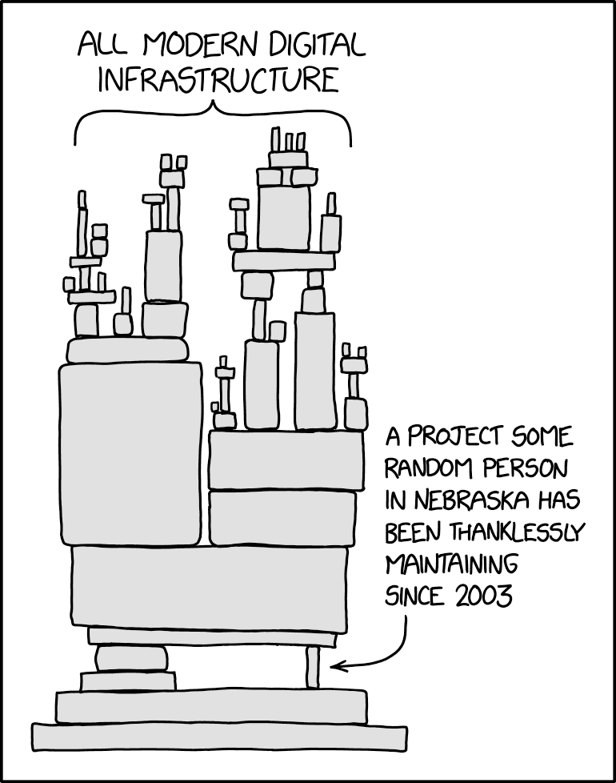

The Public Suffix List is an initiative of Mozilla, but is maintained as a community resource. It is available for use in any software, but was originally created to meet the needs of browser manufacturers.

- **The PSL project website**: [https://publicsuffix.org](https://publicsuffix.org/)

The Public Suffix List is playing a crucial role in the operation of the Internet, yet it's maintained by a small team toiling in obscurity. 

- **Interesting to read:** [The Present and Future of the Public Suffix List](https://www.m3aawg.org/blog/PublicSuffixList?trk=article-ssr-frontend-pulse_little-text-block)

#### **What is eTLD?**

The PSL is a list of domain names that are controlled by a single organization.

For example, `co.uk` is a PSL domain, but `uk` is a TLD.

In Japan, while `jp` is a TLD, `co.jp` and `ne.jp` is an effective TLD. Japan even has city-level eTLDs like `tokyo.jp`.

The PSL is useful for extracting the root domain from a URL.

Here is a visualization of the hierarchy of some more examples:

)](Untitled_3.png)

Source: Steve Jones ([https://www.linkedin.com/pulse/public-suffix-list-needs-support-we-also-need-something-steve-jones](https://www.linkedin.com/pulse/public-suffix-list-needs-support-we-also-need-something-steve-jones))

#### **EDA implications**

In the EDA section, we are also going to explore the pricing of domain names. The PSL is useful for this analysis because the prices are different for second-level domains (SLDs) and top-level domains (TLDs) in some cases. For example, the price of `.co.uk` may be different from `.uk`.

#### Integrating the PSL Data

```python
psl = PublicSuffixList()

## Extract the domain and second level domain (SLD)
def extract_domain_and_sld(url):
    parsed_url = urlparse(url)
    domain = parsed_url.netloc

    if not domain:
        domain = url.split('/')[0] #passed directly as domain names

    # Strip away port numbers and username/password in URL
    domain = domain.split('@')[-1].split(':')[0]

    # Replace any backslashes
    domain = domain.replace('\\', '/').split('/')[0]

    # Use publicsuffix2 to extract the second level domain (SLD)
    tld = get_tld(domain)

    return {'domain': domain, 'tld': tld}
    
## Extract the eTLD
df_features['PublicSuffix'] = df_features['URL'].apply(lambda x: extract_domain_and_sld(x)['tld'])
```

Make sure the public suffixes have been extracted properly:

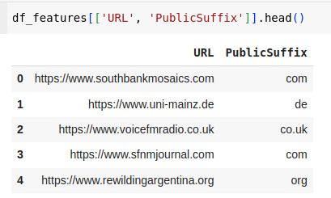

```python
## List the unique values of PublicSuffix
unique_ps = df_features['PublicSuffix'].unique()
print(f"Unique PublicSuffix: {unique_ps}")

## Check for null values
num_nulls_ps = df_features['PublicSuffix'].isnull().sum()
print(f"Number of null in PublicSuffix: {num_nulls_ps}")

## Output: Number of null in PublicSuffix: 0 
```

### Integrating the Domain Pricing Data

#### Background on Pricing of Domain Names

**How domains are acquired?**

The domains are acquired through domain registrars. The domain registrars are mostly accredited by the registries. The domain registrars are responsible for selling domain names to the public.

Note - difference between registrar and registry: The registry is responsible for managing the top-level domain (TLD) and the registrar is responsible for selling the domain names to the public.

)](Untitled_5.png)

Source: Cloudflare ([https://www.cloudflare.com/learning/dns/glossary/what-is-a-domain-name-registrar/](https://www.cloudflare.com/learning/dns/glossary/what-is-a-domain-name-registrar/))

**So, at what price are domains sold?**

The domain prices are set by the domain registrars. The prices vary depending on the domain extension. For example, '.com' domains are generally more expensive than '.xyz' domains. So, that makes '.xyz' more likely to be used by phishers.

#### Acquire Pricing Data of Domain Names

Since different domain registrar charges prices differently even for the same domain suffix. For example, GoDaddy sells `.com` more expensive than Namecheap.

We assume that the phisers want to save money and they will choose the cheapest domain registrar to buy the domain. So, we will use the cheapest price of the domain suffix as the price of the domain suffix available in the market.

#### Acquiring the Domain Market Data

One of the best sources for domain pricing data is the domain registrars themselves. We will use the [tld-list.com](http://tld-list.com/) platform, which provides domain pricing data for various domain registrars.

)](Untitled_6.png)

Source: TLD-list ([https://tld-list.com](https://tld-list.com/))

The data has been dumped from the [tld-list.com](http://tld-list.com/) platform and stored in a Cloudflare R2 storage bucket. We will download the data and load it into a dataframe.

```python
## Load the TLD pricing data
df_tld_pricing = pd.read_csv('tld-pricing.csv')
df_tld_pricing.head()
```

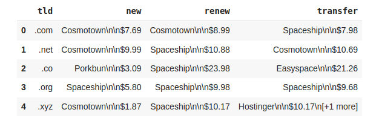

Obviously, we need to perform some data cleaning work.

```python
## remove anything before '$' for all cols and all rows
df_tld_pricing['new'] = df_tld_pricing['new'].str.extract(r'(\d+\.\d+)').astype(float)
df_tld_pricing = df_tld_pricing.drop(columns=['renew', 'transfer'])
df_tld_pricing = df_tld_pricing.reset_index(drop=True)

## get rid of the first dot in tld, if exists
df_tld_pricing['tld'] = df_tld_pricing['tld'].str.replace('.', '', 1)

## df_tld_pricing.head()

## rename columns 'new': 'DomainPrice', 'tld': 'PublicSuffix'
df_tld_pricing.columns = ['PublicSuffix', 'DomainPrice']

## drop any rows missing 'new' price
df_tld_pricing = df_tld_pricing.dropna(subset=['DomainPrice'])
df_tld_pricing = df_tld_pricing[df_tld_pricing['DomainPrice'] > 0] # keep only > 0 prices
```

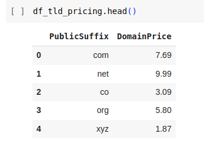

There are certain suffixes of which a domain price is not available due to many reasons. We impute these values with the median domain price, which is $15.60, a reasonable price in the domain name industry.

Note: Not all TLDs have pricing data. We will fill the missing values with the `median_domain_price` of the TLDs. For TLDs missing pricing data, we have to use the median price of the TLDs. Some registry prices are crazy high, and we don't want to skew the data by using a mean.

```python
median_domain_price = df_tld_pricing['DomainPrice'].median()
## Median Domain Price: $15.60
```

#### Convert the IDN Domains (Punycode)

You may have noticed that in the "Fix TLD Data" step, some suffix looks weird. For example, `xn--90ais`. This is because they are in the Internationalized Domain Name (IDN) format. We will convert them to the Unicode format.

IDN domains are internationalized domain names that uses non-ASCII characters.

Learn more about IDN: [https://www.icann.org/resources/pages/idn-2012-02-25-en](https://www.icann.org/resources/pages/idn-2012-02-25-en)

For example, the IDN domain `example.公司` will be converted to the punycode domain `example.xn--55qx5d`

```python
def convert_ascii_to_punycode(ascii_str):
    return ascii_str.encode('idna').decode('utf-8')

example_idn = '公司'
example_idn_int = convert_ascii_to_punycode(example_idn)
print(f"Example IDN: {example_idn} => {example_idn_int}")

## Example IDN: 公司 => xn--55qx5d
```

#### Join the TLD Pricing Data with `df_features`

Now we have acquired all market prices for the TLDs. We will join the pricing data with the `df_features` dataframe.

```python
df_features = pd.merge(df_features, df_tld_pricing, on='PublicSuffix', how='left')
df_features.head(2)
```

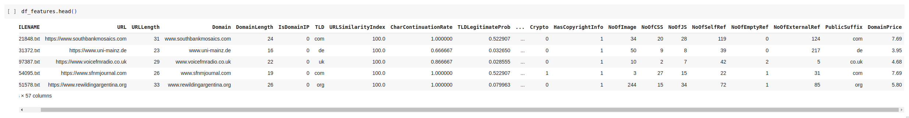

### Remove Unnecessary Labels

We will remove the columns that are not needed for the analysis. This includes the `Title`, `URL`, `Domain`, and `FILENAME` columns.

NOTE: These columns are not needed for the analysis but could be useful for other types of analysis such as NLP or extracting additional features if needed.

```python
df_features = df_features.drop(columns=['Title', 'URL', 'Domain', 'FILENAME'])
```

### Understanding Features (Input) Data

```python
## sort the columns in alphabetic order
df_features = df_features.reindex(sorted(df_features.columns), axis=1).reset_index(drop=True)

df_features.nunique() # number of unique values
```

Output:

```
Bank                               2
CharContinuationRate             898
Crypto                             2
DegitRatioInURL                  575
DomainLength                     101
DomainPrice                      406
DomainTitleMatchScore            152
HasCopyrightInfo                   2
HasDescription                     2
HasExternalFormSubmit              2
HasFavicon                         2
HasHiddenFields                    2
HasObfuscation                     2
HasPasswordField                   2
HasSocialNet                       2
HasSubmitButton                    2
HasTitle                           2
IsDomainIP                         2
IsHTTPS                            2
IsResponsive                       2
LargestLineLength              26181
LetterRatioInURL                 709
LineOfCode                     10738
NoOfAmpersandInURL                31
NoOfCSS                          209
NoOfDegitsInURL                  182
NoOfEmptyRef                     296
NoOfEqualsInURL                   25
NoOfExternalRef                 1191
NoOfImage                        992
NoOfJS                           253
NoOfLettersInURL                 421
NoOfObfuscatedChar                20
NoOfOtherSpecialCharsInURL        74
NoOfPopup                        115
NoOfQMarkInURL                     5
NoOfSelfRedirect                   2
NoOfSelfRef                     1374
NoOfSubDomain                     10
NoOfURLRedirect                    2
NoOfiFrame                       119
ObfuscationRatio                 146
Pay                                2
PublicSuffix                    2100
Robots                             2
SpacialCharRatioInURL            240
TLD                              570
TLDLegitimateProb                465
TLDLength                         12
URLCharProb                   227421
URLLength                        482
URLSimilarityIndex             36360
URLTitleMatchScore               497
dtype: int64
```

Note that although many fields appear numerical, they could actually be categorical, especially if some fields have only 2 unique values.

Additionally, labels with names beginning with "Has" or "Is" are likely to be categorical data.

```python
df_features.describe()

print(f"Number of total features: {df_features.shape[1]}, before splitting")
```

Number of total features: 53, before splitting.

#### Split numerical and categorical input features

```python
## split non-numeric and numeric columns
df_features_numerical = df_features.select_dtypes(include=[np.number])
df_features_categorical = df_features.select_dtypes(exclude=[np.number])

## categorize the columns with field name starting with 'Has' and 'Is' as categorical
has_columns = [col for col in df_features.columns if col.startswith('Has')]
is_columns = [col for col in df_features.columns if col.startswith('Is')]

df_features_categorical = pd.concat([df_features_categorical, df_features[has_columns], df_features[is_columns]], axis=1)
df_features_numerical = df_features_numerical.drop(columns=has_columns + is_columns)

df_features_numerical.describe() # to examine if they are indeed numerical
```

Let’s move while observing the features to categorical if they only have 0 and 1 values.

```python
## move the features to categorical if they only have 0 and 1 values
for col in df_features_numerical.columns:
    if df_features_numerical[col].nunique() == 2:
        if set(df_features_numerical[col].unique()) == {0, 1}:
            print(f"Moving {col} to categorical")
            df_features_categorical[col] = df_features_numerical[col]
            df_features_numerical = df_features_numerical.drop(columns=col)
```

Output (checked the values to make sure they are indeed categorical):

```
Moving Bank to categorical
Moving Crypto to categorical
Moving NoOfSelfRedirect to categorical
Moving NoOfURLRedirect to categorical
Moving Pay to categorical
Moving Robots to categorical
```

After splitting the data:

```python
print(f"Number of numerical features: {df_features_numerical.shape[1]}")
print(f"Number of categorical features: {df_features_categorical.shape[1]}")
print(f"Total number of features: {df_features_numerical.shape[1] + df_features_categorical.shape[1]}")
```

We have identified:

- 32 numerical features
- 21 categorical features
- A total of 53 features

```python
df_features_numerical.dtypes
df_features_numerical.nunique() # number of unique values

df_features_categorical.dtypes
df_features_categorical.nunique() # number of unique values
```

```
## Field names of categorical data:
df_features_categorical.columns

Index(['PublicSuffix', 'TLD', 'HasCopyrightInfo', 'HasDescription',
       'HasExternalFormSubmit', 'HasFavicon', 'HasHiddenFields',
       'HasObfuscation', 'HasPasswordField', 'HasSocialNet', 'HasSubmitButton',
       'HasTitle', 'IsDomainIP', 'IsHTTPS', 'IsResponsive', 'Bank', 'Crypto',
       'NoOfSelfRedirect', 'NoOfURLRedirect', 'Pay', 'Robots'],
      dtype='object')
      
## Field names of numerical data:
df_features_numerical.columns

Index(['CharContinuationRate', 'DegitRatioInURL', 'DomainLength',
       'DomainPrice', 'DomainTitleMatchScore', 'LargestLineLength',
       'LetterRatioInURL', 'LineOfCode', 'NoOfAmpersandInURL', 'NoOfCSS',
       'NoOfDegitsInURL', 'NoOfEmptyRef', 'NoOfEqualsInURL', 'NoOfExternalRef',
       'NoOfImage', 'NoOfJS', 'NoOfLettersInURL', 'NoOfObfuscatedChar',
       'NoOfOtherSpecialCharsInURL', 'NoOfPopup', 'NoOfQMarkInURL',
       'NoOfSelfRef', 'NoOfSubDomain', 'NoOfiFrame', 'ObfuscationRatio',
       'SpacialCharRatioInURL', 'TLDLegitimateProb', 'TLDLength',
       'URLCharProb', 'URLLength', 'URLSimilarityIndex', 'URLTitleMatchScore'],
      dtype='object')
```

We will proceed to analyze the data following the split.

### **One Hot Encoding**

In machine learning, most algorithms require input data in a numerical format because they perform calculations with these numbers during the learning process. Categorical data, such as labels or categories, inherently lack a numerical representation and thus cannot be directly processed by these algorithms. 

Converting these categorical variables into a numerical format allows machine learning algorithms to efficiently include these features in computations for tasks like classification or regression.

Let’s now convert our categorical variables from two `DataFrame` subsets (**`df_features_categorical`** and **`df_features`**) into numerical format by applying one-hot encoding. 

```python
## One hot encode categorical labels
if do_one_hot_encoding:
    df_features_categorical_encoded = pd.get_dummies(df_features_categorical, columns=categorical_columns_lst)
    df_features_encoded = pd.get_dummies(df_features, columns=categorical_columns_lst)
```

### Completing the Preprocessing Steps

We have successfully completed the data preprocessing steps and now have the following dataframes ready for our next steps:

- `df_urls_data` contains the original dataset, including both features and target.
- `df_features` contains the features only.
- `df_features_raw` contains the raw features such as the URL, Title, and Domain.
- `df_features_encoded` contains the encoded features.
- `df_target` contains the target only.
- `df_features_numerical` contains the numerical features only.
- `df_features_categorical` contains the categorical features only.
- `df_features_categorical_encoded` contains the encoded categorical features

---

## **Exploratory Data Analysis**

### Install Dependencies

First, let's install the required dependencies and then import them.

```python
!pip install pandas numpy matplotlib seaborn scikit-learn

## visualization of missing values
!pip install missingno

## plotly
!pip install plotly
!pip install "nbformat>=4.2.0"

## country codes conversion
!pip install pycountry

## scipy
!pip install scipy
```

```python
## import packages
import pandas as pd
import numpy as np

import missingno as msno

from scipy.stats import chi2_contingency
from scipy.stats import ttest_ind

import matplotlib.pyplot as plt
import seaborn as sns
from collections import Counter
import seaborn as sns
import plotly.express as px
```

```python
## Check the first 5 rows to get a feel of the data
df_urls_data.head()
```

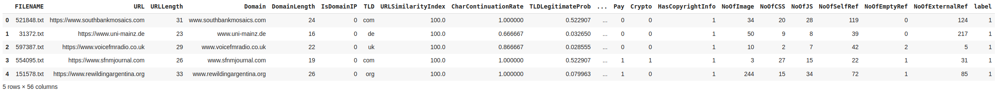

Let's also check the shape of the dataframes. Make sure they are loaded correctly from the preprocessing notebook.

```python
## Check the shape of categorical data
print(f"Shape of df_features_categorical: {df_features_categorical.shape}")
print("Data types of df_features:")
df_features_categorical.info()

## Check the shape of numerical data
print(f"Shape of df_features_numerical: {df_features_numerical.shape}")
print("Data types of df_features_numerical:")
df_features_numerical.info()
```

```
Shape of df_features_categorical: (235795, 21)
Data types of df_features:
<class 'pandas.core.frame.DataFrame'>
RangeIndex: 235795 entries, 0 to 235794
Data columns (total 21 columns):
 #   Column                 Non-Null Count   Dtype 
---  ------                 --------------   ----- 
 0   PublicSuffix           235795 non-null  object
 1   TLD                    235795 non-null  object
 2   HasCopyrightInfo       235795 non-null  int64 
 3   HasDescription         235795 non-null  int64 
 4   HasExternalFormSubmit  235795 non-null  int64 
 5   HasFavicon             235795 non-null  int64 
 6   HasHiddenFields        235795 non-null  int64 
 7   HasObfuscation         235795 non-null  int64 
 8   HasPasswordField       235795 non-null  int64 
 9   HasSocialNet           235795 non-null  int64 
 10  HasSubmitButton        235795 non-null  int64 
 11  HasTitle               235795 non-null  int64 
 12  IsDomainIP             235795 non-null  int64 
 13  IsHTTPS                235795 non-null  int64 
 14  IsResponsive           235795 non-null  int64 
 15  Bank                   235795 non-null  int64 
 16  Crypto                 235795 non-null  int64 
 17  NoOfSelfRedirect       235795 non-null  int64 
 18  NoOfURLRedirect        235795 non-null  int64 
 19  Pay                    235795 non-null  int64 
 20  Robots                 235795 non-null  int64 
dtypes: int64(19), object(2)
memory usage: 37.8+ MB

Shape of df_features_numerical: (235795, 32)
Data types of df_features_numerical:
<class 'pandas.core.frame.DataFrame'>
RangeIndex: 235795 entries, 0 to 235794
Data columns (total 32 columns):
 #   Column                      Non-Null Count   Dtype  
---  ------                      --------------   -----  
 0   CharContinuationRate        235795 non-null  float64
 1   DegitRatioInURL             235795 non-null  float64
 2   DomainLength                235795 non-null  int64  
 3   DomainPrice                 235795 non-null  float64
 4   DomainTitleMatchScore       235795 non-null  float64
 5   LargestLineLength           235795 non-null  int64  
 6   LetterRatioInURL            235795 non-null  float64
 7   LineOfCode                  235795 non-null  int64  
 8   NoOfAmpersandInURL          235795 non-null  int64  
 9   NoOfCSS                     235795 non-null  int64  
 10  NoOfDegitsInURL             235795 non-null  int64  
 11  NoOfEmptyRef                235795 non-null  int64  
 12  NoOfEqualsInURL             235795 non-null  int64  
 13  NoOfExternalRef             235795 non-null  int64  
 14  NoOfImage                   235795 non-null  int64  
 15  NoOfJS                      235795 non-null  int64  
 16  NoOfLettersInURL            235795 non-null  int64  
 17  NoOfObfuscatedChar          235795 non-null  int64  
 18  NoOfOtherSpecialCharsInURL  235795 non-null  int64  
 19  NoOfPopup                   235795 non-null  int64  
 20  NoOfQMarkInURL              235795 non-null  int64  
 21  NoOfSelfRef                 235795 non-null  int64  
 22  NoOfSubDomain               235795 non-null  int64  
 23  NoOfiFrame                  235795 non-null  int64  
 24  ObfuscationRatio            235795 non-null  float64
 25  SpacialCharRatioInURL       235795 non-null  float64
 26  TLDLegitimateProb           235795 non-null  float64
 27  TLDLength                   235795 non-null  int64  
 28  URLCharProb                 235795 non-null  float64
 29  URLLength                   235795 non-null  int64  
 30  URLSimilarityIndex          235795 non-null  float64
 31  URLTitleMatchScore          235795 non-null  float64
dtypes: float64(11), int64(21)
memory usage: 57.6 MB
```

```python
## Visualize missing values as a matrix
msno.matrix(df_features_categorical)
```

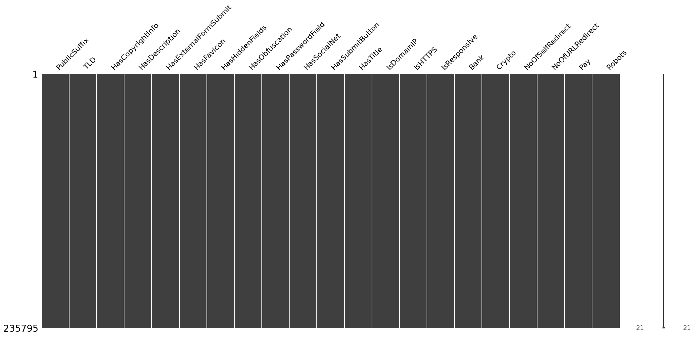

It appears that there are no missing values in the dataset. This is good news!

### Understanding Target Data

#### Number of phishing vs legitimate data

The target label of this dataset is binary, where `0` represents phishing and `1` represents legitimate.

So, the next question come to my mind: **How balanced is the target of our dataset?**

Check how many phishing and non-phishing data in the dataset.

```python
non_phishing_counts = sum(df_target['label'] == 1)
phishing_counts = sum(df_target['label'] == 0)

## let's count the number of phishing and non-phishing URLs
print(f"Non-phishing counts: {non_phishing_counts} "
      f"(Percentage: {non_phishing_counts/len(df_target)*100:.2f}%)") #get percentage
print(f"Phishing counts: {phishing_counts} "
      f"(Percentage: {phishing_counts/len(df_target)*100:.2f}%)") #get percentage
```

We obtained:

- Non-phishing counts: 134850 (Percentage: 57.19%)
- Phishing counts: 100945 (Percentage: 42.81%)

Let's also visualize the distribution of the target label.

```python
plt.figure(figsize=(6, 4))

## Plot for phishing
sns.countplot(x='label',
data=df_target, hue='label',
palette='viridis')

plt.title('Count of Phishing vs Non-Phishing URLs')
plt.xlabel('label')
plt.ylabel('Count')
plt.xticks(ticks=[0, 1],
            labels=['Phishing','Non-Phishing'])

plt.show()
```

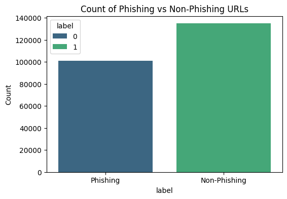

Based on the distribution, we can see the target label is not too imbalanced. We can proceed with the dataset as it is.

### Understanding Numerical Features

#### Correlation Matrix

```python
## combine df_features_numerical and df_target
df_urls_numerical = pd.concat([df_features_numerical, df_target], axis=1)

columns = df_urls_numerical.columns.tolist()

corr_mat = df_urls_numerical.corr()

plt.figure(figsize=(64, 64))
sns.heatmap(
    corr_mat,
    cmap='RdBu',
    vmin=-1,
    vmax=1,
    center=0,
    annot=True,
    fmt=".1f"
)

plt.show()
```

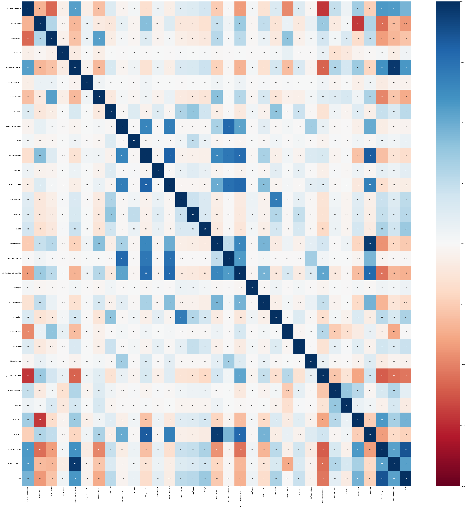

Identify the feature pairs that have high correlation (threshold = 0.8):

- NoOfEqualsInURL and NoOfDegitsInURL has high correlation = 0.80602442162387
- URLLength and NoOfDegitsInURL has high correlation = 0.8358093990245989
- URLLength and NoOfLettersInURL has high correlation = 0.9560469859044239
- URLTitleMatchScore and DomainTitleMatchScore has high correlation = 0.9610084343550412
- label and URLSimilarityIndex has high correlation = 0.8603580349950561

```python
## Print features having high correlation with the target 'label'
corr_target = corr_mat['label'].sort_values(ascending=False)
corr_target_top_5 = corr_target.head(6)
corr_target_top_5 = corr_target_top_5[1:] # remove label itself

corr_target_top_5
```

```python
URLSimilarityIndex       0.860358
DomainTitleMatchScore    0.584905
URLTitleMatchScore       0.539419
URLCharProb              0.469749
CharContinuationRate     0.467735
Name: label, dtype: float64
```

#### **Violin Plots**

Plot violin plots for the numerical features with the target label `Phishing`.

Recall `0` represents phishing and `1` represents legitimate.

```python
for feature in columns:
    plt.figure(figsize=(10, 6))
    sns.violinplot(x='label', y=feature, data=df_urls_numerical, hue='label', split=True, palette='muted')
    plt.title(f'Violin Plot of {feature}')
    plt.xlabel('Label')
    plt.ylabel(feature)
    plt.show()
```

Here are some examples of the generated violin plots:

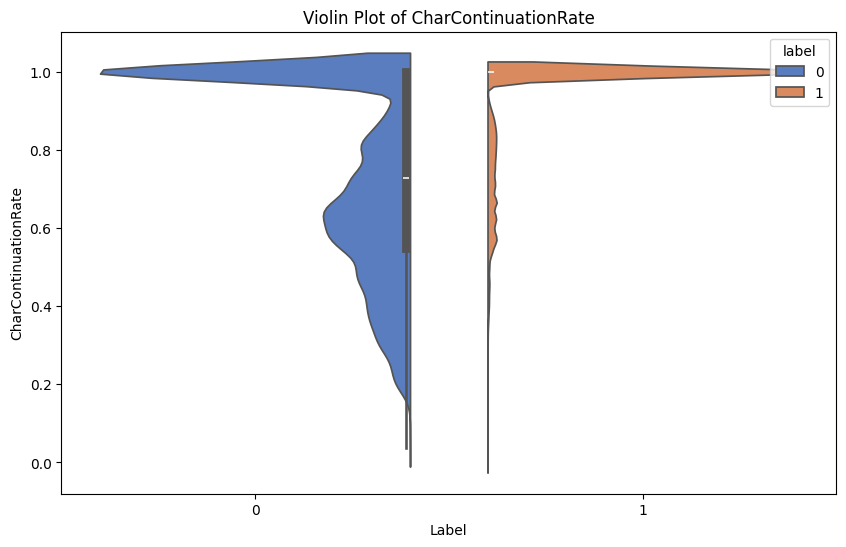

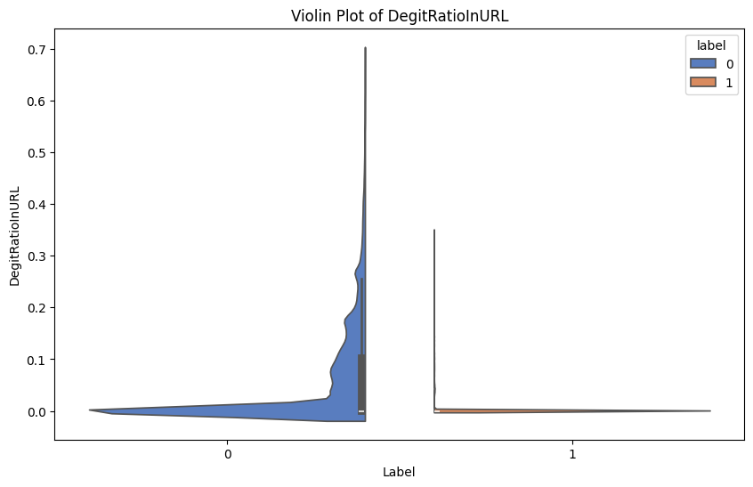

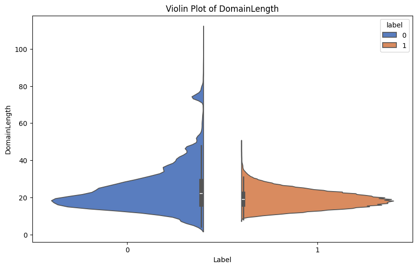

#### Interactive Box Plots

Plot for the top 5 features that have the highest correlation with the target.

**NOTE**: To view the interactive plot, you MUST run the code below. The plot is not saved as an image in the notebook, so you won't be able to see it if you don't run the code.

```python
for column in corr_target_top_5.index:
    fig = px.box(df_urls_numerical, y=column, color=df_target['label'])
    fig.show()
```

#### Statistical Tests

For all numerical features, perform t-tests to compare means:

```python
numerical_t_results = {}

for feature in columns:
    # skip label
    if feature == 'label':
        continue
    phishing = df_features_numerical[df_target['label'] == 0][feature]
    non_phishing = df_features_numerical[df_target['label'] == 1][feature]
    t_stat, p_val = ttest_ind(phishing, non_phishing)
    print(f"T-test for {feature}: Stat={t_stat}, P-value={p_val}")
    numerical_t_results[feature] = (t_stat, p_val)
```

#### Most Important Numerical Features

Features with small p-values are considered more important for our classification model.

```python
## top features with the smallest p-value
numerical_t_results_sorted = sorted(numerical_t_results.items(), key=lambda x: x[1][1])
numerical_t_results_sorted[:10]
```

That gives us

```
[('CharContinuationRate', (-256.9673224005409, 0.0)),
 ('DegitRatioInURL', (232.61796808324493, 0.0)),
 ('DomainLength', (143.36142600843974, 0.0)),
 ('DomainTitleMatchScore', (-350.1667834107168, 0.0)),
 ('LetterRatioInURL', (192.05733596392525, 0.0)),
 ('LineOfCode', (-137.3940419972396, 0.0)),
 ('NoOfDegitsInURL', (87.82689697158546, 0.0)),
 ('NoOfEmptyRef', (-53.36214828900374, 0.0)),
 ('NoOfExternalRef', (-130.00859090242156, 0.0)),
 ('NoOfImage', (-138.7039740466059, 0.0))]
```

1. **`SpacialCharRatioInURL`, `DegitRatioInURL`, `LetterRatioInURL`, `NoOfOtherSpecialCharsInURL`:**
    
    This aligns with my personal experience that phishing URLs frequently use special characters, digits, and unusual letter combinations to mimic legitimate URLs, or to create confusing URLs that are more likely to deceive users.
    
2. **`DomainLength`, `NoOfLettersInURL`, `URLLength`:**
    
    These features being important makes sense because longer URLs are often used by phishers to hide malicious subdomains or paths that resemble legitimate addresses.
    
3. **`NoOfDegitsInURL`, `NoOfQMarkInURL`:**
    
    Phishing URLs may contain some digits in the url to resemble legitimate URLs. For example, if phishers want to peform phishing against UPenn students, the `upenn.edu` domain is appearently already registered, so they may register `upenn1[.]com` or `upenn2024[.]education` to trick users.
    
4. **`TLDLength`:**
    
    Abnormal TLD lengths can indicate less common or exotic TLDs used by phishers to create credible-looking URLs, for example, `upenn-pay[.]com` or `upenn-login[.]education`.
    

#### Weakest Numerical Features

These are the features that have the weakest statistical significance.

```python
## top 5 features with the largest p-value
numerical_t_results_sorted[-5:]
```

That gives us

```
[('DomainPrice', (-20.15339051241565, 2.9952761186943435e-90)),
 ('LargestLineLength', (19.979571665743187, 9.826104450198757e-89)),
 ('NoOfAmpersandInURL', (16.821978666871274, 1.834605816231233e-63)),
 ('NoOfObfuscatedChar', (7.437398819558432, 1.0303278198240061e-13)),
 ('NoOfSubDomain', (2.8917740201365536, 0.0038310837128889526))]
```

### Understanding Categorical Features

```python
## combine df_features_categorical and df_target
df_urls_categorical_visual = pd.concat([df_features_categorical, df_target], axis=1).copy()
```

For the categorical labels, let's visualize the distribution of the features against the target label.

**What are we looking for here?** We are looking for features that have a significant difference between counts of phishing and non-phishing URLs. If one has very distinct difference, this feature could play a significant role in impacting the target label.

```python
## descriptive text for the label
df_urls_categorical_visual['label_text'] = df_urls_categorical_visual['label'].map({0: 'Non-Phishing', 1: 'Phishing'})

## Skip columns with too many unique values,
##for example urls here is not useful for direct comparison
skipped_column_names = ['TLD', 'PublicSuffix', 'label', 'label_text']

for column in df_urls_categorical_visual.columns:
    if column not in skipped_column_names:
        plt.figure(figsize=(10, 4))
        ax = sns.countplot(data=df_urls_categorical_visual, x=column, hue="label_text", palette="Set1")
        plt.title(f'Distribution of {column}')
        plt.xticks(rotation=45)
        plt.legend(title='Label', loc='upper right', bbox_to_anchor=(1.05, 1), borderaxespad=0.)
        plt.show()
```

### Statistical Testing for Categorical Features

The visualization above is useful to get a feeling of the distribution of the categorical features and their significance in relationship with the target label.

Now, let's perform statistical tests to confirm the significance of the features.

Here we use [Chi-test](https://www.geeksforgeeks.org/chi-square-test-for-feature-selection-mathematical-explanation/), which is primarily used to examine whether two categorical variables (two dimensions of the contingency table) are independent in influencing the test statistic (values within the table)

Mathematically, a Chi-Square test is done on two distributions two determine the level of similarity of their respective variances. In its null hypothesis, it assumes that the given distributions are independent. This test thus can be used to determine the best features for a given dataset by determining the features on which the output class label is most dependent. For each feature in the dataset, the $\chi ^{2}$  is calculated and then ordered in descending order according to the $\chi ^{2}$  value. The higher the value of $\chi ^{2}$ , the more dependent the output label is on the feature and higher the importance the feature has on determining the output. Let the feature in question have m attribute values and the output have k class labels. Then the value of $\chi ^{2}$  is given by the following expression:

$\chi ^{2} = \sum {i=1}^{m} \sum {j=1}^{k}\frac{(O{ij}-E{ij})^{2}}{E_{ij}}$

where $O_{ij}$  – Observed frequency $E_{ij}$  – Expected frequency For each feature, a contingency table is created with m rows and k columns. Each cell (i,j) denotes the number of rows having attribute feature as i and class label as k. Thus each cell in this table denotes the observed frequency. ([source](https://www.geeksforgeeks.org/chi-square-test-for-feature-selection-mathematical-explanation/))

```python
def perform_chi2_test(df, feature):
    contingency_table = pd.crosstab(df[feature], df['label'])
    chi2, p, dof, expected = chi2_contingency(contingency_table)
    print(f"Chi-squared test for {feature}:")
    print(f"Chi2 Statistic: {chi2}, P-value: {p}\n")
    return chi2, p

chi2_stats = {}

## Perform test for each categorical feature
for column in df_urls_categorical_visual.columns:
    if column not in ['label', 'label_text']:
        chi2,p = perform_chi2_test(df_urls_categorical_visual, column)
        chi2_stats[column] = (chi2, p)
```

To help us better understand the importance, let's rank them by their $\chi ^{2}$ values.

```python
## Order by significance
chi2_stats_sorted = sorted(chi2_stats.items(), key=lambda x: x[1][0], reverse=True)
chi2_stats_sorted
```

```
[('HasSocialNet', (145023.7420316948, 0.0)),
 ('HasCopyrightInfo', (130292.68757967741, 0.0)),
 ('HasDescription', (112334.62388393158, 0.0)),
 ('PublicSuffix', (90887.69233733535, 0.0)),
 ('IsHTTPS', (87486.78604118452, 0.0)),
 ('HasSubmitButton', (78925.93676851525, 0.0)),
 ('TLD', (72390.61558625728, 0.0)),
 ('IsResponsive', (70964.98848503799, 0.0)),
 ('HasHiddenFields', (60783.768711655066, 0.0)),
 ('HasFavicon', (57473.0059661682, 0.0)),
 ('HasTitle', (49831.82697877125, 0.0)),
 ('Robots', (36346.1017555631, 0.0)),
 ('Pay', (30514.30996266347, 0.0)),
 ('Bank', (8418.032312347743, 0.0)),
 ('HasExternalFormSubmit', (6619.679733768652, 0.0)),
 ('HasPasswordField', (4501.468438718974, 0.0)),
 ('Crypto', (2338.26408286789, 0.0)),
 ('NoOfSelfRedirect', (1377.8103615413584, 1.3941584604567876e-301)),
 ('IsDomainIP', (852.260590396482, 2.3448225852057846e-187)),
 ('HasObfuscation', (646.896659124284, 1.0568883774203827e-142)),
 ('NoOfURLRedirect', (508.61027713202554, 1.2722702420876379e-112))]
```

The Chi-Square test results show that the top features that have the highest $\chi ^{2}$ values are:

1. **`HasSocialNet` (Chi2 Statistic: 145023.7420316948, P-value: 0.0)**:
    
    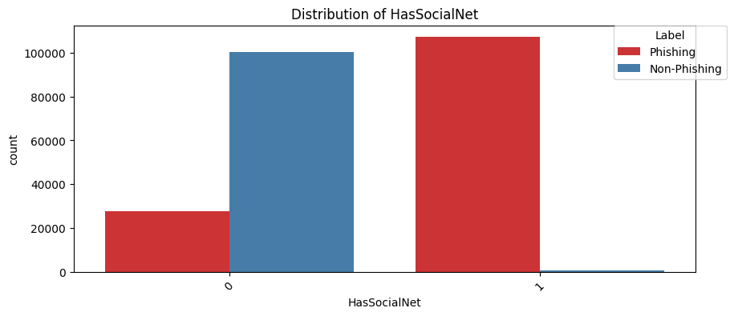
    
    This feature shows us whether a website includes social network links, which is typical for legitimate sites as they often connect to many social media platforms for marketing purposes. For example, we know that UPenn's website [https://www.upenn.edu](https://www.upenn.edu/) typically has links to their Facebook, Twitter, and Instagram pages, etc. The phishign sites, as you may expect, are less likely to include these links, as most of them are not interested in promoting their site on social media.
    
2. **`HasCopyrightInfo` (Chi2 Statistic: 130292.68757967741, P-value: 0.0)**:
    
    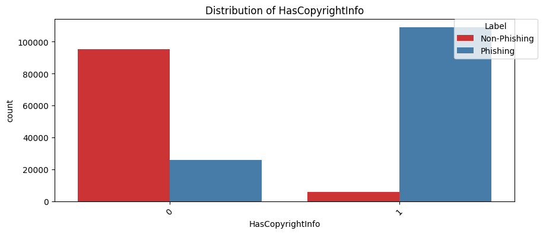
    
    Copyright information adds legitimacy to a website by indicating ownership and the legality of content, which is another common indication of a legitimate site.
    
    For example, UPenn's website [https://www.upenn.edu](https://www.upenn.edu/) has the following copyright information in the footer:
    
    ```html
    <p style="text-align: center;"><strong><a href="<https://www.seas.upenn.edu/>">
       PENN ENGINEERING </a>©2017</strong>
    </p>
    
    ```
    
    Phishing sites woudn't bother adding these info on their website.
    
3. **`HasDescription` (Chi2 Statistic: 112334.62388393158, P-value: 0.0)**:
    
    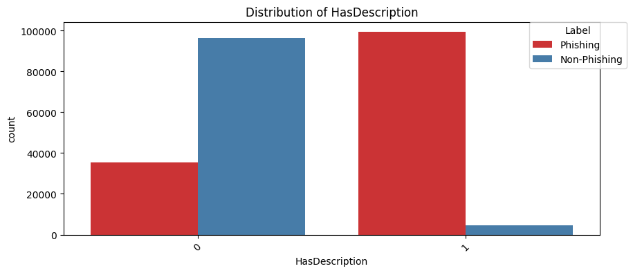
    
    Meta descriptions in the headers usually, if SEO is done right, provide a summary of the website's content on search engine results.
    
    For example, [https://www.seas.upenn.edu](https://www.seas.upenn.edu/) has the following meta description in the header:
    
    ```html
    <meta name="description" content="Penn Engineering | Inventing the Future">
    
    ```
    
    Again, a phishing site wouldn't bother with SEO aspect of things on their websites.
    
4. **`HasSubmitButton` (Chi2 Statistic: 78925.93676851525, P-value: 0.0)**:
    
    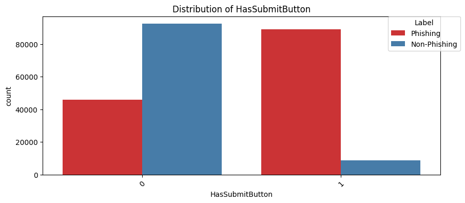
    
    The presence of a submit button is common in forms where user input is required. Legitimate sites design these elements to be user-friendly and secure. Phishing sites often have forms designed to harvest data, so there is a higher chance of them having submit buttons.
    
5. **`IsHTTPS` (Chi2 Statistic: 87486.78604118452, P-value: 0.0)**:
    
    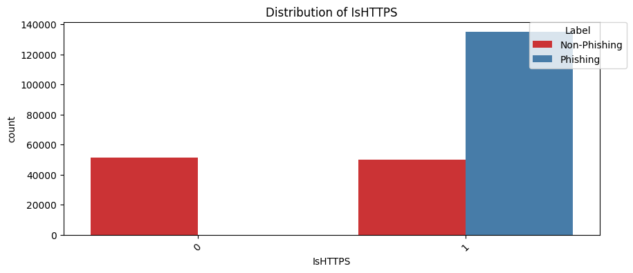
    
    HTTPS indicates that a site uses a secure protocol with installed SSL cert to encrypt data between the user and the server. Many phishing sites now also use HTTPS to appear legitimate, at least for those ones I personally encountered. The significant chi-squared statistic shows this feature is statistically significant for distinguishing between phishing and non-phishing sites.
    
6. **`HasFavicon` (Chi2 Statistic: 57473.0059661682, P-value: 0.0)**:
    
    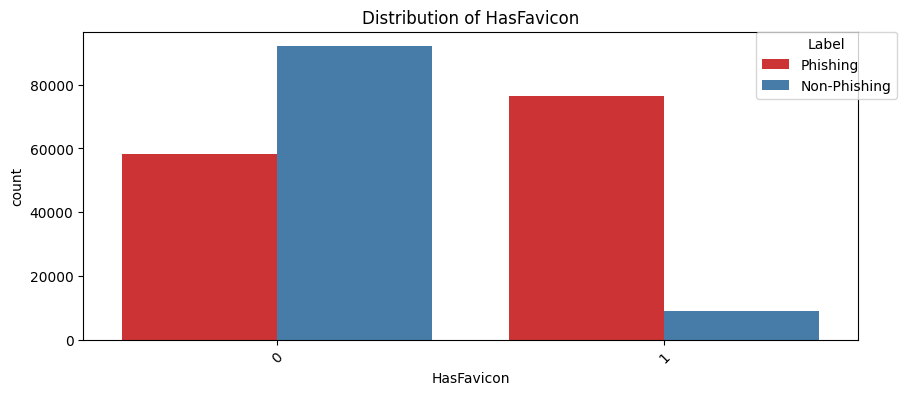
    
    Favicons are small icons associated with a website, typically displayed in browser tabs and bookmarks. For example, visiting UPenn website [https://www.upenn.edu](https://www.upenn.edu/) will show you the UPenn logo in the browser tab. Phishing sites might not use custom favicons.
    

### TLD Phishing Abuse Analysis over the `TLD` field

Top-level domains (TLDs), which are the final segments of a domain name, are frequently utilized by malicious actors. They often create domains with TLDs that mimic well-known and trusted extensions, deceiving users into visiting counterfeit websites (Anon, 2023a).

The introduction of new TLDs like `.zip` and `.mov` has enabled cybercriminals to register domains that look like familiar file extensions. This can mislead users into thinking they are downloading a safe file, when in fact, they are being directed to a phishing URL.

Shortly after the release of these TLDs, numerous phishing domains were registered (Anon, 2023b). Phishers commonly use TLDs that mirror well-known brands or trusted entities to trick users into believing they are accessing legitimate websites. ([source](https://www.sciencedirect.com/science/article/pii/S0167404823004558))

So, let's analyze the `TLD` field to see if there are any patterns that we can identify.

```python
## List the top 20 most frequentlt abused TLDs
df_urls_categorical_phishing = df_urls_categorical_visual[df_urls_categorical_visual['label'] == 0] # 0 is phishing
top_phishing_tlds = df_urls_categorical_phishing['TLD'].value_counts().head(50)
## top_phishing_tlds
```

```python
## histogram for top_phishing_tlds
plt.figure(figsize=(10, 6))
sns.barplot(x=top_phishing_tlds.index, y=top_phishing_tlds.values, legend=False)
plt.title('Top 50 Most Frequently Abused TLDs')
plt.xlabel('Top Level Domains')
plt.ylabel('Count')
plt.xticks(rotation=90)
plt.show()
```

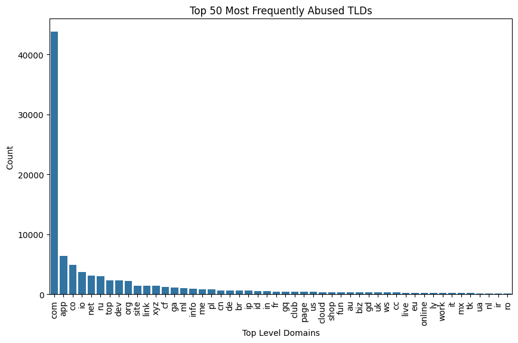

### The Most Abused ccTLDs (country code TLDs)

ccTLD is a top-level domain that is generally reserved or used for a country or a dependent territory.

For example, `.us` is the ccTLD for the United States. The ccTLDs are assigned by the Internet Assigned Numbers Authority (IANA) to the national governments of countries and are always two letters long.

For more info about ccTLD: [https://icannwiki.org/Country_code_top-level_domain](https://icannwiki.org/Country_code_top-level_domain)

So, let's filter for the domains that have ccTLDs.

```python
## Filter for only ccTLDs (2 chars) from TLDs
df_urls_categorical_cctlds = df_urls_categorical_visual[df_urls_categorical_visual['TLD'].str.len() == 2]
print(f"Number of ccTLDs: {len(df_urls_categorical_cctlds)}")
## Number of ccTLDs: 69596

## List the top 20 most frequently abused ccTLDs
df_urls_categorical_phishing_cctlds = df_urls_categorical_cctlds[df_urls_categorical_cctlds['label'] == 0] # 0 is phishing
top_phishing_cctlds = df_urls_categorical_phishing_cctlds['TLD'].value_counts().head(50)
top_phishing_cctlds

##get a list of countries and a list of counts
abused_cctld_countries = top_phishing_cctlds.index.tolist()
abused_cctld_counts = top_phishing_cctlds.values.tolist()
```

```python
## histogram for top_phishing_cctlds
plt.figure(figsize=(10, 6))
sns.barplot(x=top_phishing_cctlds.index, y=top_phishing_cctlds.values, legend=False)
plt.title('Top 50 Most Frequently Abused ccTLDs')
plt.xlabel('Country Top Level Domains')
plt.ylabel('Count')
plt.xticks(rotation=90)
plt.show()
```

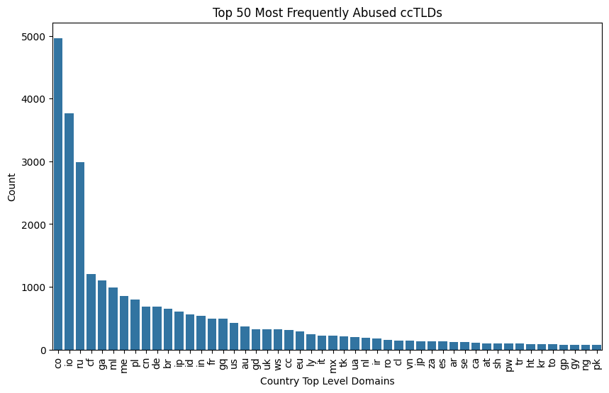

#### Global Heat Map of ccTLD Phishing Abuse Counts

Finally, let's visualize the global distribution of the ccTLD abuse counts on a world map.

Because the `plotly` package supports only 3 letter country codes, we need to map the 2 letter country codes to 3 letter country codes using the `pycountry` package.

```python
import pycountry

## convet two-letter codes to three-letter ISO codes
def alpha2_to_alpha3(alpha2):
    country = pycountry.countries.get(alpha_2=alpha2.upper())
    print(f"Country: {country}")
    return country.alpha_3 if country else None
```

Plot a global map based on the two digit country codes:

```python
## Create a DataFrame for plotting
data = pd.DataFrame({
    'Country': [alpha2_to_alpha3(cc)
                for cc in abused_cctld_countries],
    'Counts': abused_cctld_counts
})

## Plot a global map based on the two digit country codes
fig = px.choropleth(
    data_frame=data,
    locations='Country',
    locationmode='ISO-3',
    color='Counts',
    title='Global Map of Most Abused ccTLDs',
    hover_name='Country',
    color_continuous_scale=px.colors.sequential.Bluered,
    projection='natural earth'
)

fig.show()
```

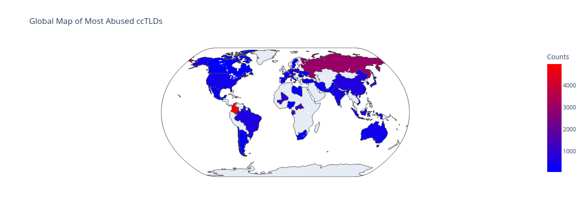

The following bullet list provides a brief overview of some of the most abused country code top-level domains (ccTLDs):

- **Colombia (.co)**: 4964 instances
- **British Indian Ocean Territory (.io)**: 3769 instances
- **Russia (.ru)**: 2983 instances
- **Central African Republic (.cf)**: 1203 instances
- **Gabon (.ga)**: 1107 instances
- **Mali (.ml)**: 994 instances
- **Montenegro (.me)**: 853 instances
- **Poland (.pl)**: 802 instances
- **China (.cn)**: 690 instances
- **Germany (.de)**: 686 instances
- **Brazil (.br)**: 653 instances
- **Philippines (.ph)**: 608 instances
- **Indonesia (.id)**: 560 instances
- **India (.in)**: 537 instances

---

## **Logistic Regression**

In this analysis, we first use the basic Logistic Regression for binary classification task.

```python
lr = LogisticRegression()
lr.fit(X_train, y_train)

## Use the model to predict on the test set and save these predictions as `y_pred`
y_pred = lr.predict(X_test)

## Find the accuracy and store the value in `log_acc`
log_acc = lr.score(X_test, y_test)

print(f"accuracy: {log_acc}")

## accuracy: 0.9971302958763907
```

The accuracy of the Logistic Regression model, as determined by comparing the predicted labels against the actual labels in **`y_test`**, is impressively high at approximately 99.71%. 

### **PCA to Reduce Dimensionality**

Before proceeding with another round of Logistic Regression, we apply Principal Component Analysis (PCA) to reduce the dimensionality of the feature set. PCA is a statistical technique that transforms a large set of variables into a smaller one that still contains most of the information in the large set.

First, the feature set is standardized to ensure that PCA's performance is not biased by the nature of scale invariance.

```python
std_s = StandardScaler()
X_train_scaler = std_s.fit_transform(X_train)
X_test_scaler = std_s.transform(X_test)

## Instantiate and Fit PCA
pca = PCA(n_components = X_train_scaler.shape[1])
pca_x_train = pca.fit_transform(X_train_scaler)

## Save the explained variance ratios
explained_variance_ratios = pca.explained_variance_ratio_

## Save the CUMULATIVE explained variance ratios 
cum_evr = np.cumsum(explained_variance_ratios)
```

By examining the cumulative explained variance ratio, we determine the number of components that account for 80% of the variance in the dataset:

```
thresh = 0.8

## Plotting
plt.figure(figsize=(8, 6))
sns.lineplot(x=np.arange(1, len(cum_evr) + 1), y=cum_evr, label='Cumulative Explained Variance')
sns.lineplot(x=np.arange(1, len(cum_evr) + 1), y=[thresh] * len(cum_evr), linestyle='--', label='80% Threshold')

plt.xlabel('Number of Components')
plt.ylabel('Cumulative Explained Variance Ratio')
plt.title('Cumulative Explained Variance Ratio vs. Number of Components')
plt.xticks(ticks=np.arange(1, len(explained_variance_ratios) + 1, step=max(1, len(explained_variance_ratios) // 10)))  # Adjust step for readability
plt.legend()
plt.show()
```

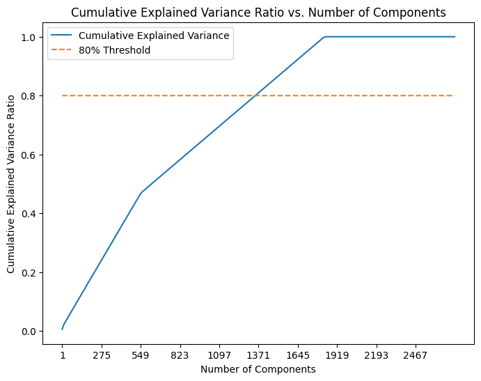

```python
pca = PCA(n_components = num_components)
X_train_pca = pca.fit_transform(X_train_scaler)

## Transform on Testing Set
X_test_pca = pca.transform(X_test_scaler)
```

## **Logistic Regression with PCA**

After reducing the dimensionality, Logistic Regression is applied again on this transformed dataset. The model is trained on the PCA-transformed training set and evaluated against the PCA-transformed test set.

```python
log_reg_pca = LogisticRegression()
log_reg_pca.fit(X_train_pca, y_train)

## Use the model to predict on the PCA transformed test set and save these predictions as `y_pred`
y_pred = log_reg_pca.predict(X_test_pca)

##Find the accuracy and store the value in `test_accuracy`
test_accuracy = log_reg_pca.score(X_test_pca, y_test)
print(f"accuracy: {test_accuracy}")

## accuracy: 0.9979219383932484
```

The accuracy after applying PCA is slightly reduced to approximately 99.79% compared to the original Logistic Regression model.

## **Ridge Regression**

Ridge regression is effective in handling multicollinearity (high correlation among independent variables) and overfitting, which are common issues in high-dimensional datasets. 

By incorporating a degree of bias into the regression estimates through the regularization term, ridge regression reduces the model's variance and makes it less susceptible to noise in the training data.

```python
## Split the data into training and testing sets
X_train, X_test, y_train, y_test = train_test_split(df_features_encoded, df_target, test_size=0.2, random_state=42)

## Standardize the feature data since regularization is sensitive to the scale of input features
scaler = StandardScaler()
X_train_scaled = scaler.fit_transform(X_train)
X_test_scaled = scaler.transform(X_test)

## Create Ridge Regression model
ridge_reg = Ridge(alpha=1.0)  # alpha is the regularization strength; larger values specify stronger regularization

## Fit the model
ridge_reg.fit(X_train_scaled, y_train)

## Predict on the test data
y_pred = ridge_reg.predict(X_test_scaled)

## Evaluate the model using RMSE
rmse = np.sqrt(mean_squared_error(y_test, y_pred))
print(f"Root Mean Squared Error: {rmse}")
coefficients = pd.DataFrame(ridge_reg.coef_, columns=df_features_encoded.columns, index=['Coefficient']).transpose()
print(coefficients.sort_values(by='Coefficient', ascending=False))
```

```python
Root Mean Squared Error: 0.12415411373986451
```

- The RMSE value confirms the model's effectiveness in predicting phishing URLs with a small average error, implying reliability in practical applications. The analysis of coefficients allows understanding the influence of different features on the phishing likelihood. It shows that the model effectively captures both intuitive and non-intuitive relationships within the data.
- URLLength (1.220800): The positive coefficient of URLLength indicates that longer URLs are likely associated with phishing. This aligns with typical phishing behavior where longer URLs may be used to obfuscate dubious parts of the URL or to mimic complex legitimate URLs.
- NoOfDegitsInURL (-0.355845) and NoOfLettersInURL (-0.849399): These features having negative coefficients suggest that a higher count of digits or letters reduces the likelihood of a URL being phishing, which might indicate that shorter, simpler URLs (with fewer characters) are often safer.

## **Linear Regression (Unregularized)**

Linear Regression is straightforward and one of the most easily interpretable models for regression tasks:

- The coefficients directly show the expected change in the target variable with a one-unit change in the feature.
- It can handle large datasets.
- It's generally fast to train, especially when compared to more complex models that require iterative processes to converge.

```python
## Split the data into training and testing sets
X_train, X_test, y_train, y_test = train_test_split(df_features_encoded, df_target, test_size=0.2, random_state=42)

## Initialize the Linear Regression model
linear_reg = LinearRegression()

## Fit the model on the training data
linear_reg.fit(X_train, y_train)

## Predict on the test data
y_pred = linear_reg.predict(X_test)

## Evaluate the model using Mean Squared Error
mse = mean_squared_error(y_test, y_pred)
print(f"Mean Squared Error: {mse}")

## Optionally, display the model coefficients
coefficients = pd.DataFrame(data=linear_reg.coef_[0], index=df_features_encoded.columns, columns=['Coefficients'])
print(coefficients.sort_values(by='Coefficients', ascending=False))
```

```python
Mean Squared Error: 0.015373646065718673
```

The low MSE indicate a good fit, and the analysis of coeffients can indicate the influence of each feature on the prediction. 

However, given the model's lack of regularization and the dataset's high dimensionality, there is a risk of overfitting.

## **Linear Regression (Unregularized) with PCA**

PCA is used to reduce the number of features in a dataset by transforming the original features into a new set of variables, which are linear combinations of the original features.

PCA helps in mitigating issues like multicollinearity among features by ensuring that the principal components are orthogonal (independent of each other). 

This independence is crucial for models like Linear Regression, which assume little or no multicollinearity among independent variables.

```python
## Standardize features (important for PCA)
scaler = StandardScaler()
features_scaled = scaler.fit_transform(df_features_encoded)

## Split the data into training and testing sets
X_train, X_test, y_train, y_test = train_test_split(features_scaled, df_target, test_size=0.2, random_state=42)

## Initialize PCA
pca = PCA(n_components=0.95)
X_train_pca = pca.fit_transform(X_train)
X_test_pca = pca.transform(X_test)

## Check how many components were selected
print(f"PCA selected {pca.n_components_} components")

## Initialize the Linear Regression model
linear_reg = LinearRegression()

## Fit the model on the training data
linear_reg.fit(X_train_pca, y_train)

## Predict on the test data
y_pred = linear_reg.predict(X_test_pca)

## Evaluate the model using Mean Squared Error and R-squared
mse = mean_squared_error(y_test, y_pred)
r2 = r2_score(y_test, y_pred)

print(f"Mean Squared Error: {mse}")
print(f"R-squared: {r2}")

```

```python
PCA selected 1739 components
Mean Squared Error: 0.026263884226329685
R-squared: 0.8926387776461615
```

- Mean Squared Error (MSE) of 0.026263884226329685: This MSE is higher than the previous model without PCA (which had an MSE of 0.015373646065718673). While this indicates a slight decrease in the accuracy per prediction, it's essential to consider that this might be an acceptable trade-off for the benefits of dimensionality reduction, such as simpler models and faster computation times.
- R-squared of 0.8926387776461615: This is a strong R-squared value, indicating that approximately 89.26% of the variance in the target variable is predictable from the independent variables (principal components in this case).
- High R-squared values suggest a good fit of the model to the data, confirming that despite the increase in MSE, the model with PCA still explains a significant portion of the variance.

## **Random Forest Classifier**

Next, we use a Random Forest Classifier, which is a nice method known for its high accuracy and ability to operate over complex datasets with a mixture of categorical and numerical data.

```python
## Initialize model with default parameters and fit it on the training set
rfc = RandomForestClassifier(class_weight = "balanced", n_estimators = 120, max_depth = 30, random_state =42)
rfc.fit(X_train, y_train)

##Use the model to predict on the test set and save these predictions as `y_pred`
y_pred = rfc.predict(X_test)

## Find the accuracy and store the value in `rf_acc`
rf_acc = rfc.score(X_test, y_test)
print(f"accuracy: {rf_acc}")

## accuracy: 0.9999717270529693
```

We observe an even higher accuracy of nearly 100% (99.997%).

```python
cm = confusion_matrix(y_test, y_pred)
plt.figure(figsize=(8, 6))
p = sns.heatmap(pd.DataFrame(cm), annot=True, cmap="YlGnBu", fmt='g')
plt.title('Confusion Matrix', y=1.1)
plt.ylabel('Actual Label')
plt.xlabel('Predicted Label')
plt.show()
```


## **Random Forest Regression**

Random Forest can handle large datasets with thousands of features and potentially complex nonlinear relationships without feature selection or dimensionality reduction.

It naturally models interactions between features, making it effective in cases where the predictive power arises from the combination of features.

```python
## Split the data into training and testing sets
X_train, X_test, y_train, y_test = train_test_split(df_features_encoded, df_target, test_size=0.2, random_state=42)

## Initialize the Random Forest Regressor
random_forest_regressor = RandomForestRegressor(n_estimators=100, random_state=42)

## Fit the model on the training data
random_forest_regressor.fit(X_train, y_train.values.ravel())

## Predict on the test data
y_pred = random_forest_regressor.predict(X_test)

## Evaluate the model using Mean Squared Error and R-squared
mse = mean_squared_error(y_test, y_pred)
r2 = r2_score(y_test, y_pred)

print(f"Mean Squared Error: {mse}")
print(f"R-squared: {r2}")
```

- The Mean Squared Error: 2.1204860153947286e-09 is higher than the previous regression models. But it's still accetpble number for the model prediction.
- The R-squared value is nearly to 1,indicating that most of the cariance in the target cariable is predictable from the independent variables.

## **Decision Tree classifier**

### Preprocessing and PCA

#### Splitting Training Data

The dataset is prepared for model training by initially splitting it into training and test sets.

Here, we are following the standard practice in machine learning, the data is divided using a test size of 40%, with **`train_test_split`** ensuring random but consistent selections with a **`random_state`**.

```python
from sklearn.model_selection import train_test_split
from sklearn.preprocessing import StandardScaler
from sklearn.decomposition import PCA

X_train, X_test, y_train, y_test = train_test_split(df_features_encoded, df_target,
                                                    test_size = 0.4, random_state = 42)
```

After splitting, the next step is to standardize the features.

We rescale the features so that they have the properties of a standard normal distribution with mean = 0, SD = 1. This is to make sure all features are centered around 0 and have variance in the same order.

```python
scaler = StandardScaler()
X_train_scaled = scaler.fit_transform(X_train)
X_test_scaled = scaler.transform(X_test)
```

Principal Component Analysis (PCA) is then applied to the scaled training data. 

```python
pca = PCA()
X_train_pca = pca.fit_transform(X_train_scaled)
```

PCA is a dimensionality reduction technique that transforms the original variables into a new set of variables, which are linear combinations of the original variables.

To understand how many principal components to retain, we examine the explained variance ratio provided by PCA. 

```python
## Save the explained variance ratios into variable called "explained_variance_ratios"
explained_variance_ratios = pca.explained_variance_ratio_

## Save the CUMULATIVE explained variance ratios into variable called "cum_evr"
cum_evr = np.cumsum(pca.explained_variance_ratio_)
```

Typically, we look for the point where the cumulative explained variance ratio reaches a threshold that shows a good balance between information retention and model simplicity, which we set here at 70% (`thresh = 0.7`):

```python
thresh = 0.7

## find optimal num components to use (n) by plotting explained variance ratio (2 points)
plt.figure(figsize = (8, 6))

sns.lineplot(x = range(1, len(cum_evr) + 1), y = cum_evr)
sns.lineplot(x = range(1, len(cum_evr) + 1), y = thresh, linestyle='--')

plt.xlabel('Number of components')
plt.ylabel('Cumulative explained_variance_ratio')
plt.title('Cumulative explained variance ratio')

plt.show()
```

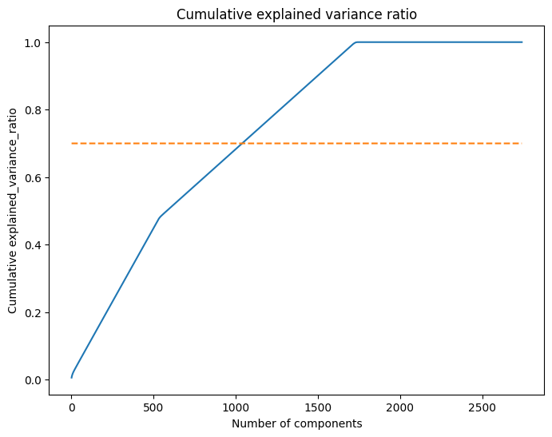

```python
n_components_pca = np.argmax(cum_evr >= thresh) + 1
n_components_pca
## output: 1039
```

In this case, after plotting, it appears that 1039 components are required to explain 70% of the variance. 

So, 1039 = the optimal number of principal components needed to capture the majority of variance in the data while reducing dimensionality.

Let’s reapply PCA with this specific number to transform both the training and testing datasets:

```python
pca = PCA(n_components = n_components_pca)
X_train_pca = pca.fit_transform(X_train_scaled)
X_test_pca = pca.transform(X_test_scaled)
```

This transformation results in new training and testing sets that are now reduced in dimensionality but still capture the essence of the original datasets!

### Decision tree

We start our exploration of decision tree classifiers by setting up a basic model using the default parameters.

```python
clf = tree.DecisionTreeClassifier(random_state = 42)
clf.fit(X_train_pca, y_train)
```

Here we can print out the entire tree.

```python
dot_data = tree.export_graphviz(clf, out_file = None)
graph = pydotplus.graph_from_dot_data(dot_data)
img = Image(graph.create_png())
img
```

It shows the decision paths from the root to the leaves:


Next, we evaluate the model on the test dataset to assess its accuracy. Using this tree to predict test data, we get the following:

```python
y_pred = clf.predict(X_test_pca)

test_accuracy = accuracy_score(y_test, y_pred)
print(f"The test accuracy with basic decision tree is {test_accuracy}")
```

The test accuracy with basic decision tree is 0.9925464916558875

The reported accuracy from the basic decision tree is impressively high, at approximately 99.25%.

To further assess the model's performance, we analyze the confusion matrix:

```python
cm = confusion_matrix(y_test, y_pred)

plt.figure(figsize=(8, 6))
p = sns.heatmap(pd.DataFrame(cm), annot=True, cmap="YlGnBu", fmt='g')
plt.title('Confusion Matrix', y=1.1)
plt.ylabel('Actual Label')
plt.xlabel('Predicted Label')
plt.show()
```


#### **Optimizing Decision Tree Depth**

To improve the decision tree model, we use cross-validation to determine the optimal tree depth. 

```
parameters = {'max_depth': range(3, 15)}
clf = GridSearchCV(tree.DecisionTreeClassifier(), parameters, n_jobs = -1)
clf.fit(X = X_train_pca, y = y_train)

tree_model = clf.best_estimator_

print(f"The best parameter is {clf.best_params_} and the corresponding train score is {clf.best_score_}")
```

The best parameter is {'max_depth': 14} and the corresponding train score is 0.9943524447559969

 We proceed to retrain our decision tree classifier using this optimized depth:

```python
clf = tree.DecisionTreeClassifier(max_depth = 14)
clf.fit(X_train_pca, y_train)

y_pred = clf.predict(X_test_pca)

test_accuracy = accuracy_score(y_test, y_pred)
print(f"The test accuracy with best max depth decision tree is {test_accuracy}")
```

The test accuracy with best max depth decision tree is 0.9932992641913526

The corresponding decision tree is a more balanced tree and the testing accuracy is higher than the decision tree above.

```python
dot_data = tree.export_graphviz(clf, out_file = None)
graph = pydotplus.graph_from_dot_data(dot_data)
img = Image(graph.create_png())
img
```


Updated confusion matrix:

```python
cm = confusion_matrix(y_test, y_pred)
plt.figure(figsize=(8, 6))
p = sns.heatmap(pd.DataFrame(cm), annot=True, cmap="YlGnBu", fmt='g')
plt.title('Confusion Matrix', y=1.1)
plt.ylabel('Actual Label')
plt.xlabel('Predicted Label')
plt.show()
```


We can also plot the ROC curve:

```python
fpr, tpr, thresholds = roc_curve(y_test, y_pred)

## plot the roc curve
plt.figure(figsize=(8, 6))
plt.plot([0,1], [0,1],'b--')
plt.plot(fpr, tpr, color = 'orange')
plt.xlabel('False Positive Rate')
plt.ylabel('True Positive Rate')
plt.title('Receiver Operating Characteristic Curve')
plt.show()
```


Observe that our decision tree analysis demonstrates the effectiveness of fine-tuning. Both the basic and optimized decision trees perform exceptionally well, which means there is great potential of using PCA-transformed features in classification tasks. 

This analysis sets the stage for exploring more complex ensemble methods or different classifiers to see if performance can be enhanced further, following more steps below:

### Bagging

Bagging is basically training multiple models on different subsets of the training dataset and then averaging their predictions to improve stability and accuracy.

Now we use bagging with decision tree classifier.

```python
t = tree.DecisionTreeClassifier(random_state = 22)
bag = BaggingClassifier(estimator = t, n_jobs = -1)
bag = bag.fit(X_train_pca, y_train.values.ravel())

y_pred = bag.predict(X_test_pca)

test_accuracy = accuracy_score(y_test, y_pred)
print(f"The test accuracy with basic bagging (using decision tree) is {test_accuracy}")
```

The test accuracy with basic bagging (using decision tree) is 0.9952077016052079

99.52%. demonstrates the effectiveness of bagging in reducing variance and avoiding overfitting.

The confusion matrix and the ROC curve are as follows:


And ROC curve is


The confusion matrix and the ROC curve shows us the model's high performance.

## **K Nearest Neighbor (KNN)**

Next, let’s explore the K Nearest Neighbor (KNN) classifier, a simple method that classifies new cases based on a similarity measure (aka distance functions).

We first start with the basic KNN:

```python
clf = KNeighborsClassifier(n_neighbors = 3, n_jobs = -1)
clf.fit(X_train_pca, y_train.values.ravel())

y_pred = clf.predict(X_test_pca)

test_accuracy = accuracy_score(y_test, y_pred)
print(f"The test accuracy with basic bagging (using decision tree) is {test_accuracy}")
```

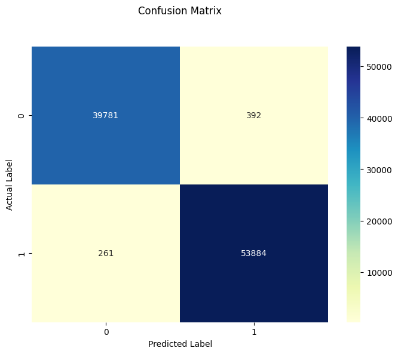

#### **Optimizing KNN Parameters**

To optimize the KNN classifier, we do a grid search to find the ideal number of neighbors.

Now we use cross validation to decide the best number of neighbors.

```python
params = {'n_neighbors': np.arange(1, 10, 2)}

clf = GridSearchCV(KNeighborsClassifier(), params, cv = 5, n_jobs = -1)
clf.fit(X_train_pca, y_train.values.ravel())

print(f"The best parameter is {clf.best_params_} and the corresponding train score is {clf.best_score_}")
```

The best parameter is {'n_neighbors': 1} and the corresponding score is 0.9929105088693813

```python
clf = KNeighborsClassifier(n_neighbors = 1, n_jobs = -1)
clf.fit(X_train_pca, y_train.values.ravel())

y_pred = clf.predict(X_test_pca)

test_accuracy = accuracy_score(y_test, y_pred)
print(f"The test accuracy for KNN with best number of neighbors is {test_accuracy}")
```

The test accuracy for KNN with best number of neighbors is 0.9939566148561251, demonstrating high true positive rates and low false positive rates.


ROC curve indicates an excellent performance:

```python
fpr, tpr, thresholds = roc_curve(y_test, y_pred)

## plot the roc curve
plt.figure(figsize=(8, 6))
plt.plot([0,1], [0,1],'b--')
plt.plot(fpr, tpr, color = 'orange')
plt.xlabel('False Positive Rate')
plt.ylabel('True Positive Rate')
plt.title('Receiver Operating Characteristic Curve')
plt.show()
```


## **Discriminant Analysis**

Linear Discriminant Analysis (LDA) is another technique we experimented. 

LDA aims at finding a new axis that maximizes the separation between multiple classes.

### LDA

```python
from sklearn.discriminant_analysis import LinearDiscriminantAnalysis as LDA
from sklearn.discriminant_analysis import QuadraticDiscriminantAnalysis as QDA

clf = LDA(solver = 'lsqr')
clf.fit(X_train_pca, y_train.values.ravel())

y_pred = clf.predict(X_test_pca)

test_accuracy = accuracy_score(y_test, y_pred)
print(f"The test accuracy with LDA is {test_accuracy}")

## The test accuracy with LDA is 0.9929705888589665
```

Initially, LDA provides an accuracy of about 99.30%.

#### **Optimizing LDA with Cross Validation**

Now we use cross validation with LDA to find the optimal shrinkage parameter.

```python
params = {'shrinkage': [0.1, 0.25, 0.5, 0.75, 1]}

clf = GridSearchCV(LDA(solver = 'lsqr'), params, cv = 5, n_jobs = -1)
clf.fit(X_train_pca, y_train.values.ravel())

print(f"The best parameter is {clf.best_params_} and the corresponding train score is {clf.best_score_}")
```

The best parameter is {'shrinkage': 0.25} and the corresponding train score is 0.992825693725328

Optimal results are achieved with a shrinkage of 0.25, slightly improving the accuracy to approximately 99.32%. 

This parameter helps us regularize the LDA model, particularly handy when dealing with multicollinearity or multiple predictor variables.

```python
clf = LDA(solver = 'lsqr', shrinkage = 0.25)
clf.fit(X_train_pca, y_train.values.ravel())

y_pred = clf.predict(X_test_pca)

test_accuracy = accuracy_score(y_test, y_pred)
print(f"The test accuracy with LDA is {test_accuracy}")

## The test accuracy with LDA is 0.9932462520409678
```


Both showcase effectiveness in classifying phishing URLs with high accuracy.

### **Quadratic Discriminant Analysis (QDA)**

We also test Quadratic Discriminant Analysis (QDA), which allows for non-linear separation between classes.

```python
clf = QDA()
clf.fit(X_train_pca, y_train.values.ravel())

y_pred = clf.predict(X_test_pca)

test_accuracy = accuracy_score(y_test, y_pred)
print(f"The test accuracy with LDA is {test_accuracy}")

## The test accuracy with LDA is 0.9796857439725185
```

However, QDA does not perform as well as LDA in this instance, with an accuracy around 97.97%. This suggests that the linear assumptions of LDA are sufficient for this dataset, and the more complex models might be overfitting or too sensitive to the specific data structure of our PCA-transformed features.

Hence, based on the test accuracy, LDA is more suitable than QDA in this case.

## **Support Vector Machine (SVM)**

Support Vector Machines (SVMs) are renowned for their ability to handle high-dimensional data effectively.

```python
from sklearn.svm import SVC
```

First we fit a Support Vector Classifier to the data with regularization parameter C of 1.0 and a linear kernel.

```python
svc = SVC(C = 1, kernel = 'linear')
svc = svc.fit(X_train_pca, y_train.values.ravel())

y_pred = svc.predict(X_test_pca)

test_accuracy = accuracy_score(y_test, y_pred)
print(f"The test accuracy with basic SVM is {test_accuracy}")
```

The test accuracy with basic SVM is 0.9967768612566 - an exceptionally high test accuracy.

To further analyze the performance, we visualize the confusion matrix and the Receiver Operating Characteristic (ROC) curve:

```python
cm = confusion_matrix(y_test, y_pred)

plt.figure(figsize=(8, 6))
p = sns.heatmap(pd.DataFrame(cm), annot=True, cmap="YlGnBu", fmt='g')
plt.title('Confusion Matrix', y=1.1)
plt.ylabel('Actual Label')
plt.xlabel('Predicted Label')
plt.show()

fpr, tpr, thresholds = roc_curve(y_test, y_pred)

## plot the roc curve
plt.figure(figsize=(8, 6))
plt.plot([0,1], [0,1],'b--')
plt.plot(fpr, tpr, color = 'orange')
plt.xlabel('False Positive Rate')
plt.ylabel('True Positive Rate')
plt.title('Receiver Operating Characteristic Curve')
plt.show()
```


The confusion matrix reveals a high number of correct predictions with very few false positives and negatives. Good news.

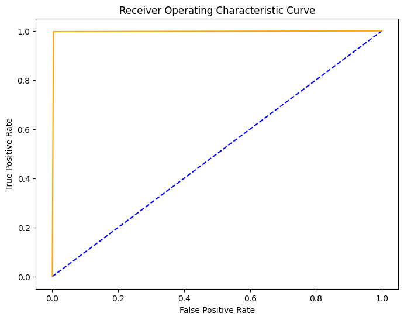

ROC curve approaches the top left corner, meaning an excellent model performance!

#### **Exploring SVM with RBF Kernel**

Now we explore the SVM with a radial basis function (RBF) kernel, which can handle non-linear data distributions:

```python
svc = SVC(C = 1, kernel = 'rbf')
svc = svc.fit(X_train_pca, y_train.values.ravel())

y_pred = svc.predict(X_test_pca)

test_accuracy = accuracy_score(y_test, y_pred)
print(f"The test accuracy with basic SVM is {test_accuracy}")
```

The test accuracy with basic SVM is 0.9910515490150342


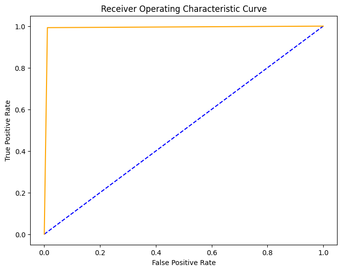

The confusion matrix for the RBF model shows slightly more misclassifications than the linear model, which is also reflected in the ROC curve. 

### **Conclusion on SVM Performance**

The comparative analysis between linear and RBF kernels in SVM shows the importance of choosing the right kernel based on the data's characteristics. 

In our specific case, the simpler linear kernel proved more effective, which shows us an interesting observation that more complex models are not always superior!

---

## **Artificial Neural Networks Classification**

### Introduction to the ANN Architecture

The ANN has three types of layers: the input layer, the hidden layers, and the output layer. Initially, the network weights are assigned randomly. As input is fed into the input layer, it progresses forward, with each subsequent hidden layer receiving the input, modified by these weights. This process continues until it reaches the output layer, where a result is produced. This result is then compared to the actual value, triggering the backpropagation algorithm to adjust the network's weights and improve future results. The neurons in each layer facilitate this learning process. Each neuron contains an activation function that determines whether and how to transmit its received signal based on the input from the previous layer. We'll explore activation functions in greater detail shortly.

](Untitled_45.png)

Source: [https://www.sciencedirect.com/topics/earth-and-planetary-sciences/artificial-neural-network](https://www.sciencedirect.com/topics/earth-and-planetary-sciences/artificial-neural-network)

Here’s a breakdown of the steps involved in this process:

1. **Assign random weights** to all linkages to initiate the algorithm.
2. **Compute the activation rate** of hidden nodes using the inputs and their linkages from the input layer.
3. **Determine the activation rate** of output nodes, using the activation rates of hidden nodes and their linkages to the output.
4. **Calculate the error rate** at the output node and adjust the linkages between hidden and output nodes to minimize this error.
5. **Propagate the error** back from the output nodes to the hidden nodes, recalibrating the linkages between the input and hidden nodes.
6. **Repeat the process** until the convergence criteria are met.
7. **Evaluate** using the final linkage weights to determine the activation rate of the output nodes.

### **Split Data to Train, Validation, and Test**

We will use the training set to fit the model, the validation set to tune the parameters (starting with the baseline model first) and the testing set for the final evaluation.

For the purpose of this project, we will use 70% for training, 15% for validation and 15% for testing. 

```python
## Set the ratios for train, validation and test
train_ratio = 0.7
validation_ratio = 0.15
test_ratio = 0.15

## we can set the seed 42 for reproducibility
random_state= 42

## Split the data into train, validation and test
X_train, X_test, y_train, y_test = train_test_split(df_features_encoded,
                                                    df_target,
                                                    test_size=1 - train_ratio,
                                                    random_state=random_state)

X_val, X_test, y_val, y_test = train_test_split(X_test,
                                                y_test,
                                                test_size=test_ratio/(test_ratio + validation_ratio),
                                                random_state=42)

## get shapes
print("Datasets after splitting:\n")
print(f"X_train: {X_train.shape}")
print(f"X_val: {X_val.shape}")
print(f"X_test: {X_test.shape}")
```

Datasets after splitting:

- X_train: (165056, 2740)
- X_val: (35369, 2740)
- X_test: (35370, 2740)

### Feature Scaling

We don't want an independent variable to dominate the others in the model. So, we will scale the features to standardize the range of independent features of data. It also makes sure the gradient descent used in training converges more efficiently.

```python
scaler = StandardScaler()
X_train = scaler.fit_transform(X_train)
X_val = scaler.transform(X_val)
X_test = scaler.transform(X_test)
```

### Using ANN for Binary Classification: The Baseline Model

Let’s first set some parameters:

- input_shape: 2740 - number of input features each input example has.
- n_batch_size: 1650 - how many rows/instances of data the network processes at once (in training)
- n_steps_per_epoch: 100 - number of batches or steps the model trains on in each epoch (i.e., how many times the model will update its weights per epoch)
- n_validation_steps: 21 - and for the for the validation dataset
- n_epochs: 25 - umber of steps (batches) to evaluate the test set

```python
input_shape = X_train.shape[1]

## num of samples per mini-batch of training data
## smaller batch size means noiser gradient, but can speed up training
n_batch_size = 100
n_steps_per_epoch = int(X_train.shape[0] / n_batch_size)
n_validation_steps = int(X_val.shape[0] / n_batch_size)
n_test_steps = int(X_test.shape[0] / n_batch_size)

## number of epochs is how often a complete 
## run through the training data is performed
n_epochs = 25

print(f"input_shape: {input_shape}")
print(f"n_batch_size: {n_batch_size}")
print(f"n_steps_per_epoch: {n_steps_per_epoch}")
print(f"n_validation_steps: {n_validation_steps}")
print(f"n_test_steps: {n_test_steps}")
print(f"n_epochs: {n_epochs}")
```

#### Build the Baseline Model

Let’s initialize the layers, neurons, activation functions, and finally compile the model with a loss function and optimizer.

Here, we used 2 fully connected layers with 16 neurons each. Because this is a binary classification problem, the output layer has 1 neuron and uses a sigmoid activation function.

**Hidden layers:**

For the hidden layers, we use ReLU function. ReLU works in a way that its outputs the input directly if it is positive; otherwise, it outputs zero. It’s simple, so this makes ReLU very straightforward and efficient computationally. Specifically it prevents our activation levels from being too high or too low (which would be problematic with some other functions that squish values into a tiny range) so the data is generates is more useful for our purpose.

**Output layer:**

The sigmoid function squishes any real value into range between 0 and 1. Think of it a kind of translator that takes a wide range of input numbers and converts them into a language of probabilities. Handy when we need to predict probabilities for classification tasks like this one.

```python
from keras import layers, models

model = models.Sequential([
    layers.Input(shape=(input_shape,)),

		# 2 fully connected layers with 16 neurons each
		model.add(layers.Dense(16, activation='relu'))
		model.add(layers.Dense(16, activation='relu'))
		
		# because this is a binary classification problem,
		# the output layer has 1 neuron and uses a sigmoid activation function
		model.add(layers.Dense(1, activation='sigmoid'))
])

model.summary()
```

Here is the layer structure:

```
Model: "sequential"
┏━━━━━━━━━━━━━━━━━━━━━━━━━━━━━━━━━┳━━━━━━━━━━━━━━━━━━━━━━━━┳━━━━━━━━━━━━━━━┓
┃ Layer (type)                    ┃ Output Shape           ┃       Param # ┃
┡━━━━━━━━━━━━━━━━━━━━━━━━━━━━━━━━━╇━━━━━━━━━━━━━━━━━━━━━━━━╇━━━━━━━━━━━━━━━┩
│ dense (Dense)                   │ (None, 16)             │        43,856 │
├─────────────────────────────────┼────────────────────────┼───────────────┤
│ dense_1 (Dense)                 │ (None, 16)             │           272 │
├─────────────────────────────────┼────────────────────────┼───────────────┤
│ dense_2 (Dense)                 │ (None, 1)              │            17 │
└─────────────────────────────────┴────────────────────────┴───────────────┘
 Total params: 44,145 (172.44 KB)
 Trainable params: 44,145 (172.44 KB)
 Non-trainable params: 0 (0.00 B)
```

Compile the model:

```python
## Configure the model for training
model.compile(loss='binary_crossentropy',
                optimizer='adam',
                metrics=['accuracy'])
```

Let’s also store the callbacks, so we may use the model later again.

```python
## store checkpoints
checkpoint_dir = f'./{checkpoint_no}'
if not os.path.exists(checkpoint_dir):
    os.makedirs(checkpoint_dir)
    
keras_callbacks = [
    ModelCheckpoint(
        filepath=os.path.join(checkpoint_dir, model_name),
        monitor='val_loss',
        save_best_only=True,
        mode='auto'
    )
]
```

#### Fit the Baseline Model

```python
history = model.fit(
    X_train,
    y_train,
    epochs=n_epochs,
    batch_size=n_batch_size,
    validation_data=(X_val, y_val),
    steps_per_epoch=n_steps_per_epoch,
    validation_steps=n_validation_steps,
    callbacks=keras_callbacks
)
```

Wait until all the epochs have been finished:

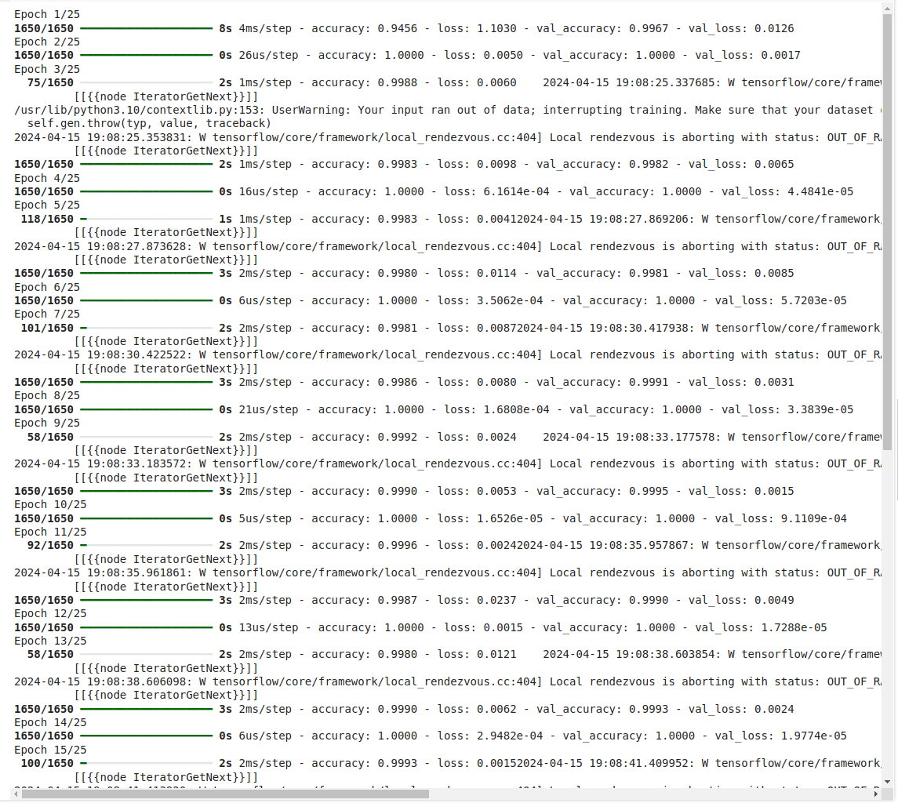

Get the best model values

```python
## Get the best model values
df_history = pd.DataFrame(history.history)
df_history['epoch'] = df_history.index + 1
df_history = df_history[['epoch'] + [col for col in df_history.columns if col != 'epoch']]
df_history.to_csv(f"{checkpoint_no}/history_df_{model_name}.csv")
df_history.head()

values_of_best_model = df_history.loc[df_history.val_loss.idxmin()]
values_of_best_model
```

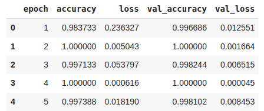

`values_of_best_model`:

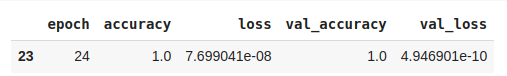

Also save the class assignments, so we can use them later.

```python
class_assignment = {'phishing': 0, 'legitimate': 1}

df_class_assignment = pd.DataFrame(list(class_assignment.items()), columns=['Category', 'Class'])
df_class_assignment.to_csv(f"{checkpoint_no}/class_assignment_df_{model_name}.csv")

## save the scaler
with open(f'{checkpoint_no}/scaler.pkl', 'wb') as f:
    pk.dump(scaler, f)
```

#### Validation

Going ahead to validation, where we will compare the models predictions on the validation set. We are going to get both the accuracy (how often the model's predictions match the true labels) and loss (how far off the predictions are from the actual results).

```dhall
accuracy = history.history['accuracy']
validation_accuracy = history.history['val_accuracy']
loss = history.history['loss']
val_loss = history.history['val_loss']
epochs = range(1, len(accuracy) + 1)

plt.figure(figsize=(12, 6))
plt.plot(epochs, accuracy, 'bo', label='Training acc')
plt.plot(epochs, validation_accuracy, 'b', label='Validation acc')
plt.title('Training and validation accuracy')
plt.legend()

plt.figure(figsize=(12, 6))
plt.plot(epochs, loss, 'bo', label='Training loss')
plt.plot(epochs, val_loss, 'b', label='Validation loss')
plt.title('Training and validation loss')
plt.legend()

plt.show()
```

Plot the training accuracy (**`accuracy`**) and validation accuracy (**`validation_accuracy`**) are plotted against the number of epochs:

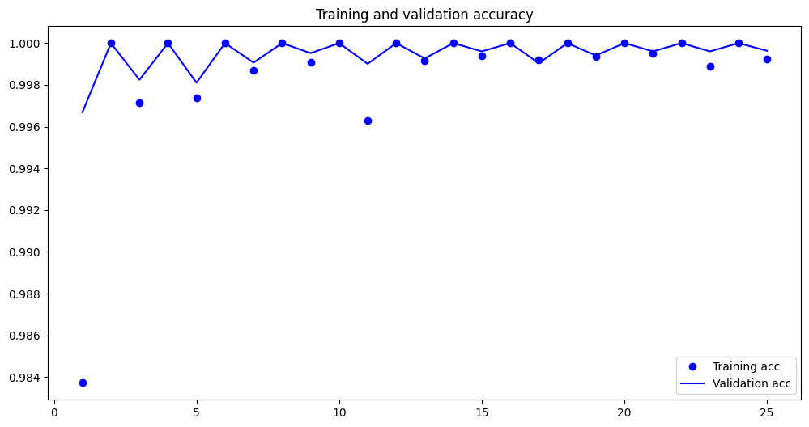

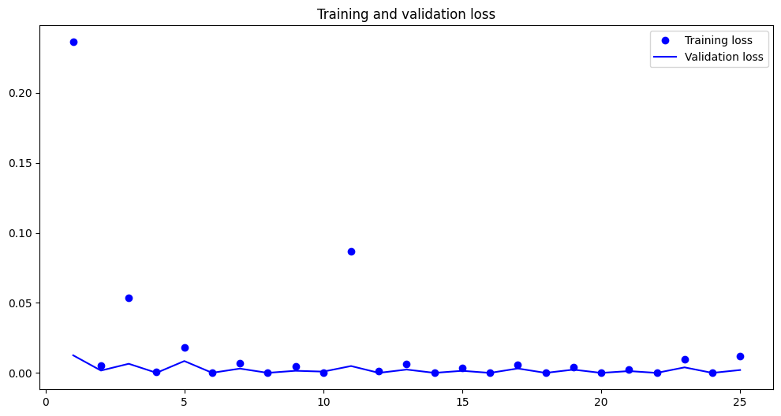

Not much overfitting observed.

#### Test the Baseline Model

```python
## Loading the saved model
model_reloaded = load_model(f"{checkpoint_no}/{model_name}")
root_directory = os.getcwd()
checkpoint_dir = os.path.join(root_directory, checkpoint_no)
saved_model_name = os.path.join(checkpoint_dir, f"{model_name}.keras")
model_reloaded.save(saved_model_name)

## Delete the saved model
saved_model_path = os.path.join(checkpoint_dir, model_name)
shutil.rmtree(saved_model_path, ignore_errors=True)

## load the best model
best_model = load_model(saved_model_name)
```

```python
test_score, test_accuracy = best_model.evaluate(X_test, y_test, n_test_steps)
print('Test Accuracy:', test_accuracy)
```

```python
101/101 ━━━━━━━━━━━━━━━━━━━━ 0s 2ms/step - accuracy: 0.9997 - loss: 0.0022  
Test Accuracy: 0.9996324777603149
```

The test accuracy is pretty high with a very low loss value. Let’s proceed with the following steps to further improve the model.

### Improve the ANN Model by Tuning the ANN and Avoiding Overfitting

#### Set Parameters

Instead of an arbitrary `n_batch_size`, here we use 1% of the training data. Smaller batch sizes can introduce more noise into the gradient descent process.

```python
input_shape = X_train.shape[1]
sample_size = X_train.shape[0]

## num of samples per mini-batch of training data
## smaller batch size means noiser gradient, but can speed up training
n_batch_size = int(0.01 * sample_size) # here we use 1% of the training data

n_steps_per_epoch = int(X_train.shape[0] / n_batch_size)
n_validation_steps = int(X_val.shape[0] / n_batch_size)
n_test_steps = int(X_test.shape[0] / n_batch_size)

## number of epochs is how often a complete
## run through the training data is performed
n_epochs = 25

print(f"input_shape: {input_shape}")
print(f"sample_size: {sample_size}")
print(f"n_batch_size: {n_batch_size}")
print(f"n_steps_per_epoch: {n_steps_per_epoch}")
print(f"n_validation_steps: {n_validation_steps}")
print(f"n_test_steps: {n_test_steps}")
print(f"n_epochs: {n_epochs}")
```

#### Implementing Early Stoping

We implement early stopping to prevent overfitting. What is does is automatically stopping the training process when the validation score stops improving.

```python
early_stopping = EarlyStopping(monitor='val_loss', patience=10)
```

#### Implementing **a Learning Rate Schedule**

Instead of a fixed `lr` let's use a learning rate schedule. This will reduce the learning rate when as training goes on.

```python
reduce_lr = ReduceLROnPlateau(monitor='val_loss', factor=0.2, patience=5, min_lr=0.001)
```

#### Implementing **the Weight Regularization**

A learning rate schedule adjusts the learning rate over time. It reduces the learning rate if the validation loss stops improving.

```python
regularizer=regularizers.l2(0.001)
```

### Build the Model

Here is where we can rename our model. 

For this project, let's name our model `URL_ANN_2FC_F16_16_epoch_25` because of the parameters we set above.

```python
checkpoint_no = 'checkpoint_1_ANN'
model_name = 'URL_ANN_2FC_F16_16_epoch_25.keras'
```

Note that `Kera` requires models to have a filename ending in `.keras`.

#### Implementing Dropout Layers

Incorporate the changes we have made, and also implement some dropout layers. 

Dropout is a regularization technique used to prevent overfitting. The dropout layer randomly sets a fraction `p` of the input units to 0 at each update during training time, which helps us to make the activation of the neurons sparse, thus reducing overfitting.

We have tried setting them at different levels from 0.1 to 0.5. Here in the example below, we set `p` to 0.5, which means we randomly exclude half of the neuron outputs from each update cycle. 

Note that in some cases setting it as high as 0.5 or above might lead to underfitting.

```python
def create_model():
    model = models.Sequential()
    model.add(layers.Input(shape=(input_shape,)))

    # 2 fully connected layers with 16 neurons each:
    model.add(layers.Dense(16,
                        kernel_regularizer=regularizer,
                        activation='relu'))

    # add some dropouts to prevent overfitting
    model.add(layers.Dropout(0.5))

    model.add(layers.Dense(16,
                        kernel_regularizer=regularizer,
                        activation='relu'))

    # add some dropouts to prevent overfitting
    model.add(layers.Dropout(0.5))

    # because this is a binary classification problem,
    # the output layer has 1 neuron and uses a sigmoid activation function
    model.add(layers.Dense(1, activation='sigmoid'))

    # Configure the model for training
    model.compile(loss='binary_crossentropy',
                optimizer='adam',
                metrics=['accuracy'])

    return model
```

Same as before:

```python
model = create_model()
model.summary()
```

```python
Model: "sequential"
┏━━━━━━━━━━━━━━━━━━━━━━━━━━━━━━━━━━━━━━┳━━━━━━━━━━━━━━━━━━━━━━━━━━━━━┳━━━━━━━━━━━━━━━━━┓
┃ Layer (type)                         ┃ Output Shape                ┃         Param # ┃
┡━━━━━━━━━━━━━━━━━━━━━━━━━━━━━━━━━━━━━━╇━━━━━━━━━━━━━━━━━━━━━━━━━━━━━╇━━━━━━━━━━━━━━━━━┩
│ dense (Dense)                        │ (None, 16)                  │          43,856 │
├──────────────────────────────────────┼─────────────────────────────┼─────────────────┤
│ dropout (Dropout)                    │ (None, 16)                  │               0 │
├──────────────────────────────────────┼─────────────────────────────┼─────────────────┤
│ dense_1 (Dense)                      │ (None, 16)                  │             272 │
├──────────────────────────────────────┼─────────────────────────────┼─────────────────┤
│ dropout_1 (Dropout)                  │ (None, 16)                  │               0 │
├──────────────────────────────────────┼─────────────────────────────┼─────────────────┤
│ dense_2 (Dense)                      │ (None, 1)                   │              17 │
└──────────────────────────────────────┴─────────────────────────────┴─────────────────┘
 Total params: 44,145 (172.44 KB)
 Trainable params: 44,145 (172.44 KB)
 Non-trainable params: 0 (0.00 B)
```

Then, we set up the callbacks following the same steps. Codes are omitted here.

#### **Fit the Model**

```python
history = model.fit(X_train, y_train,
                    epochs=n_epochs,
                    batch_size=n_batch_size,
                    validation_data=(X_val, y_val),
                    steps_per_epoch=n_steps_per_epoch,
                    validation_steps=n_validation_steps,
                    callbacks=[keras_callbacks, early_stopping, reduce_lr])
```

```python
## Get the best model values
df_history = pd.DataFrame(history.history)
df_history['epoch'] = df_history.index + 1
df_history = df_history[['epoch'] + [col for col in df_history.columns if col != 'epoch']]
df_history.to_csv(f"{checkpoint_no}/history_df_{model_name}.csv")
df_history.head()

values_of_best_model = df_history.loc[df_history.val_loss.idxmin()]
values_of_best_model
```

```python
epoch            12.000000
accuracy          1.000000
loss              0.048962
val_accuracy      1.000000
val_loss          0.022055
learning_rate     0.001000
Name: 11, dtype: float64
```

#### Validation

```python
accuracy = history.history['accuracy']
validation_accuracy = history.history['val_accuracy']
loss = history.history['loss']
val_loss = history.history['val_loss']
epochs = range(1, len(accuracy) + 1)

plt.figure(figsize=(12, 6))
plt.plot(epochs, accuracy, 'bo', label='Training acc')
plt.plot(epochs, validation_accuracy, 'b', label='Validation acc')
plt.title('Training and validation accuracy')
plt.legend()

plt.figure(figsize=(12, 6))
plt.plot(epochs, loss, 'bo', label='Training loss')
plt.plot(epochs, val_loss, 'b', label='Validation loss')
plt.title('Training and validation loss')
plt.legend()

plt.show()
```

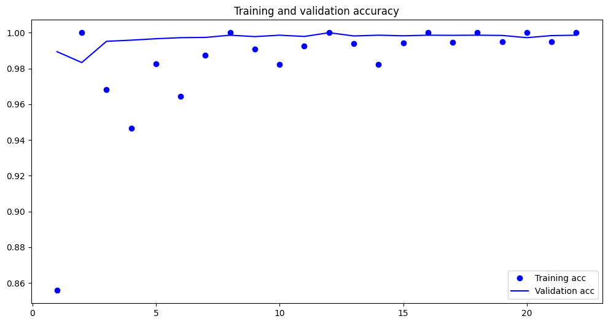

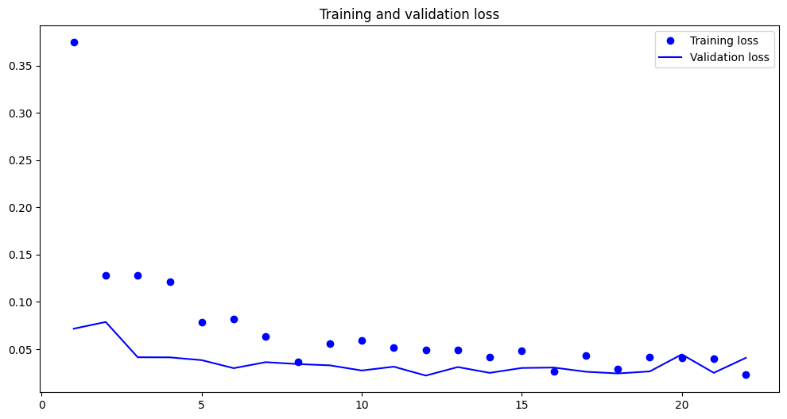

The validation loss generally remains low and close to the training loss, which suggests that the model is not overfitting and has learned the underlying patterns in the data well.

#### **Testing the Model**

```python
test_score, test_accuracy = best_model.evaluate(X_test, y_test, n_test_steps)
print(f"Test Score: {test_score}")
print(f"Test Accuracy: {test_accuracy}")
```

```python
1685/1685 ━━━━━━━━━━━━━━━━━━━━ 3s 2ms/step - accuracy: 0.9988 - loss: 0.0276
Test Score: 0.02890169993042946
Test Accuracy: 0.9984450340270996
```

The model is performing very well with high accuracy and low loss on both the training and validation datasets.

#### **Make Predictions**

```python
## Make predictions
y_pred_prob = best_model.predict(X_test)

y_pred_prob
```

```python
array([[1.2841106e-06],
       [9.9997938e-01],
       [1.0000000e+00],
       ...,
       [6.7629302e-09],
       [1.5825824e-06],
       [9.9999905e-01]], dtype=float32)
```

We need to convert the predictions to binary values.

Let's use a threshold of 0.5. If the prediction is greater than 0.5, we will consider it as `1`, otherwise `0`.

```python
y_pred = (y_pred_prob > 0.5).astype(int)
```

### **Evaluation**

#### Confusion Matrix

```python
cm = confusion_matrix(y_test, y_pred)
plt.figure(figsize=(8, 6))
p = sns.heatmap(pd.DataFrame(cm), annot=True, cmap="YlGnBu", fmt='g')
plt.title('Confusion Matrix', y=1.1)
plt.ylabel('Actual Label')
plt.xlabel('Predicted Label')
plt.show()
```


#### **Classification Report**

```python
print(classification_report(y_test, y_pred))
```

```python
              precision    recall  f1-score   support

           0       1.00      1.00      1.00     15090
           1       1.00      1.00      1.00     20280

    accuracy                           1.00     35370
   macro avg       1.00      1.00      1.00     35370
weighted avg       1.00      1.00      1.00     35370
```

#### ROC Curve

Let's plot the ROC curve to see how well the model performs. The ROC curve plots the true positive rate (TPR) against the false positive rate (FPR) at diffrent values of threshold. The closer the curve follows the left-hand border and then the top border of the ROC space, the more accurate the test.

```python
## calculate the probabilities using the classifier
y_pred_proba = best_model.predict(X_test)[:,0]

## calculate the roc curve
fpr, tpr, thresholds = roc_curve(y_test, y_pred_proba)

## plot the roc curve
plt.figure(figsize=(8, 6))
plt.plot([0,1],[0,1],'k--')
plt.plot(fpr,tpr, label='ANN')
plt.xlabel('False Positive Rate')
plt.ylabel('True Positive Rate')
plt.title('Receiver Operating Characteristic (ROC) Curve')
plt.legend(loc='lower right')
plt.show()
```

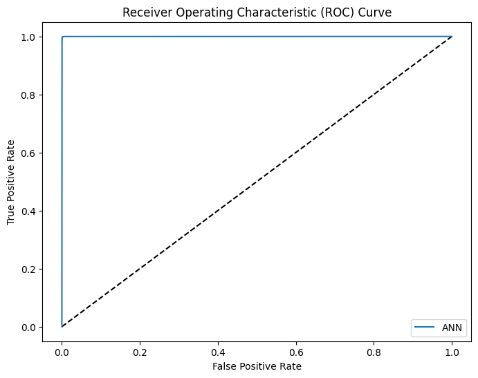

```python
## area under the curve
print(f"ROC AUC Score: {roc_auc_score(y_test, y_pred_proba)}")
```

```
ROC AUC Score: 0.9998084438797851
```

We observed that the AUC score is very close to 1, which is a good sign that the model is doing a good job to classify the URLs to be phishing or not.

### Conclusion of ANN

Overall, the model is performing very well with high accuracy and low loss on both the training and validation datasets. The consistent high accuracy and low loss over epochs without a widening gap between training and validation metrics indicate that the model is stable and generalizes well.

## Challenges

Have you attempted challenging analysis? How much time would have been required to
complete your project?

Big Data

Our project applied artificial neural network classification (ANN), which includes the baseline model, tuning ANN and avoiding overfitting, build the model and evaluation. We made modifications of the ANN model to obtain accurate prediction of the phishing websites. 

On average, each team member spent 20 hours on the project. 

## Conclusion

Our project is applied logistic regression, PCA to reduce dimensionality, logistic regression with PCA, ridge regression, linear regression (unregularized), linear regression (unregularized) with PCA, random forest classifier, random forest regression, and decision tree classifier which are taught in class. We also extend the scope to k-nearest neighbor, discriminant analysis, support vector machine (SVM), and artificial neural networks classification (ANN). 

## References

- Dutta, A. (2021). Detecting phishing websites using machine learning technique. *PLoS ONE*, 16. [https://doi.org/10.1371/journal.pone.0258361](https://doi.org/10.1371/journal.pone.0258361).
- Gastellier-Prevost, S., Granadillo, G., & Laurent, M. (2011). Decisive Heuristics to Differentiate Legitimate from Phishing Sites. *2011 Conference on Network and Information Systems Security*, 1-9. https://doi.org/10.1109/SAR-SSI.2011.5931389.
- Levy, E. (2004). Interface Illusions. *IEEE Secur. Priv.*, 2, 66-69. [https://doi.org/10.1109/MSP.2004.104](https://doi.org/10.1109/MSP.2004.104).
- Michael Fuchs Python. (2021, February 16). *NN – Artificial neural network for binary classification*. https://michael-fuchs-python.netlify.app/2021/02/16/nn-artificial-neural-network-for-binary-classification/#encoding